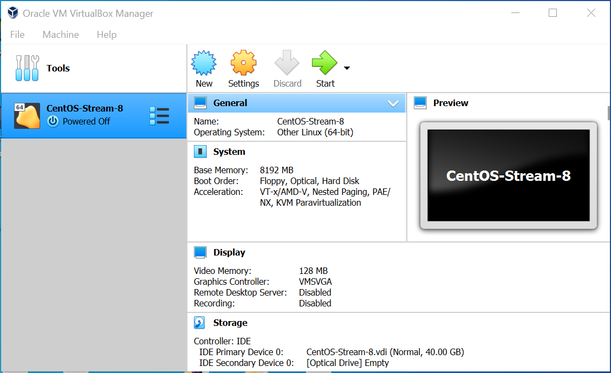
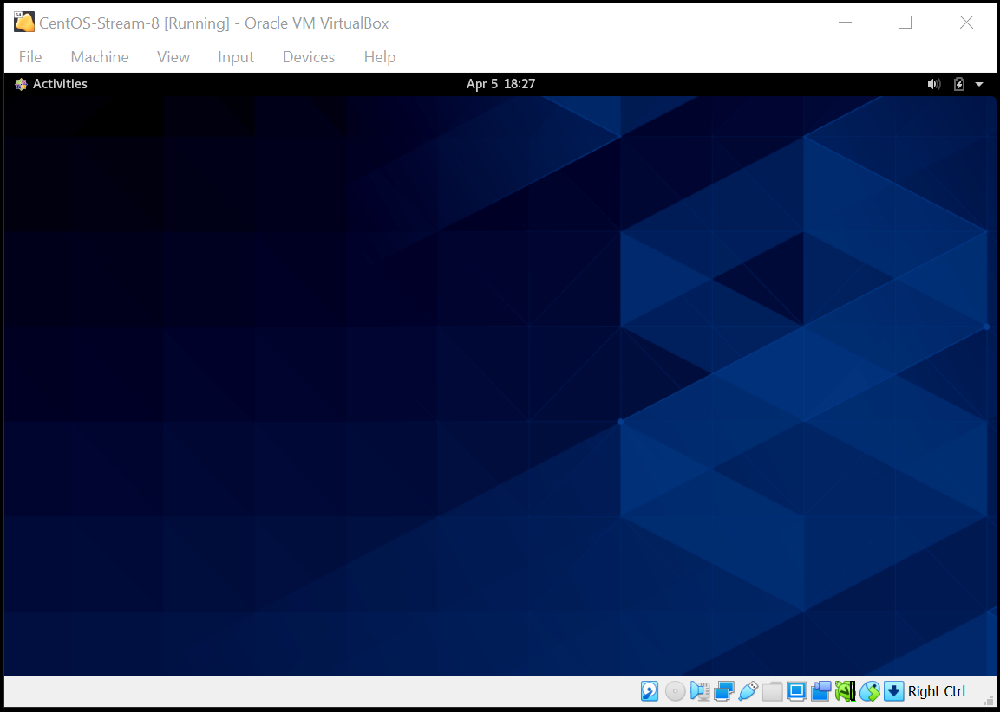
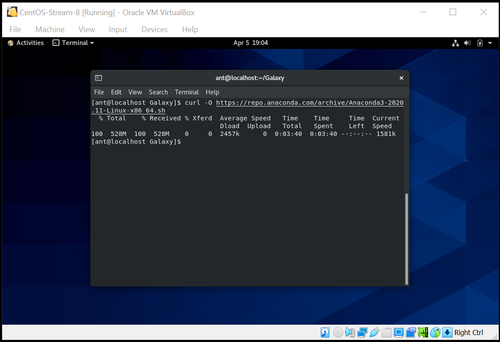
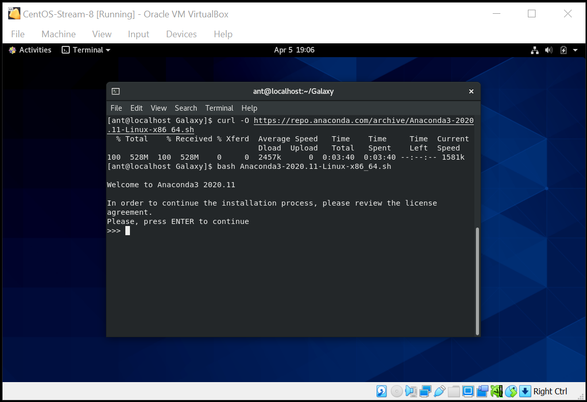
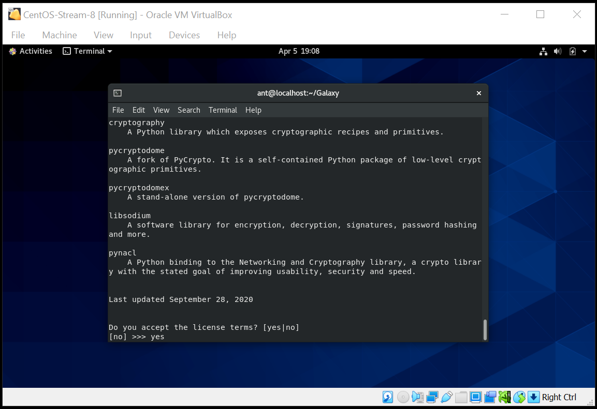
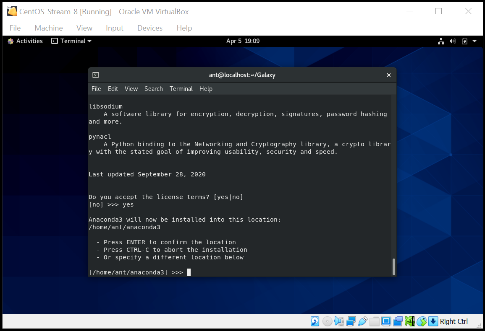
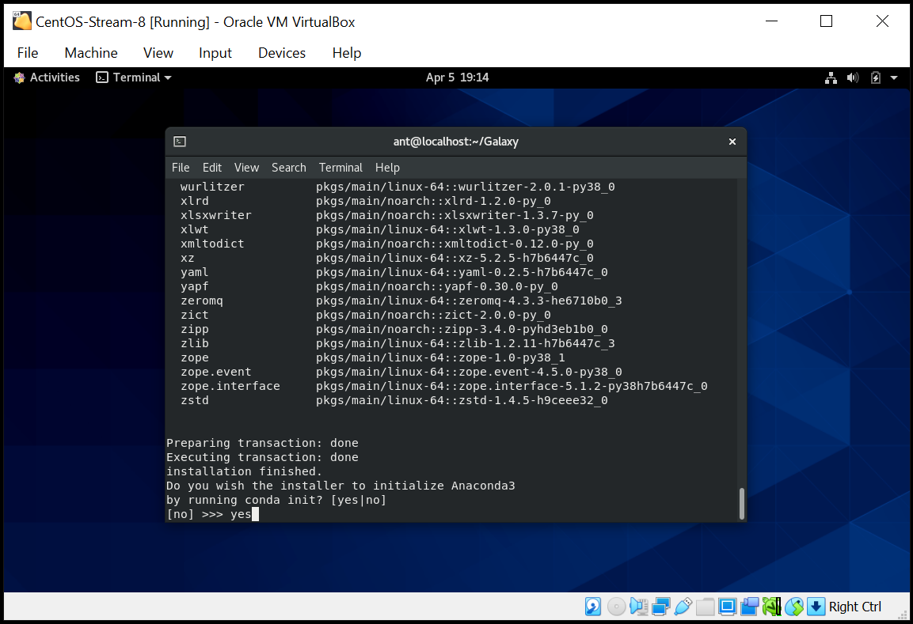

# Installing Anaconda in Linux
<br>

> The following are the instructions to install Anaconda3 (version 2020.11) on Linux. The tutorial uses a Linux CentOS-Stream-8 installed in a VirtualBox virtual machine 6.1.18, as described here: [Creating a CentOS-8 VM](https://github.com/mora-lab/installing/tree/main/virtualbox). A similar procedure can be followed by other OS.

## - Downloads
<br>

> 1. Go to your Linux machine. In our case, open the Virtual Box and start the VM.
<br>

<br>

<br>

> 2. Open a terminal and download Anaconda3 latest version (currently, 2020.11) using:
<br>
```bash
curl -O https://repo.anaconda.com/archive/Anaconda3-2020.11-Linux-x86_64.sh
```
<br>

<br>

## - Installing Anaconda
<br>

> 3. Run the downloaded file by using:
<br>
```bash
bash Anaconda3-2020.11-Linux-x86_64.sh
```
<br>

<br>

> 4. Follow the installation procedure (accept license, location, etc).
<br>

<br>

<br>

<br>

<br>

## - Activate Anaconda
<br>

> 5. Go to the bin folder and activate Anaconda.
<br>
```bash
cd /home/username/anaconda3/bin
. ./activate
```

<br>

<br>


*Last updated: Antonio Mora, May 5th, 2021*
