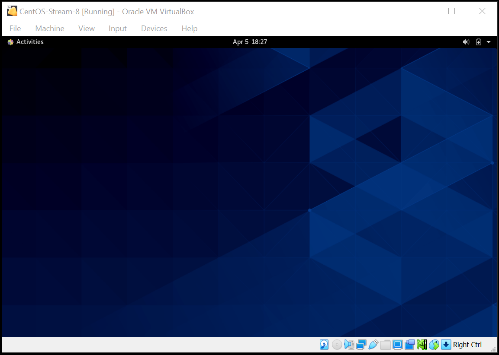
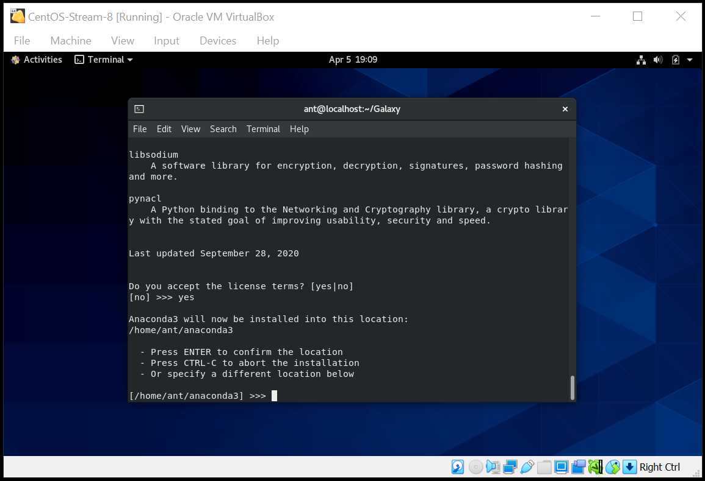
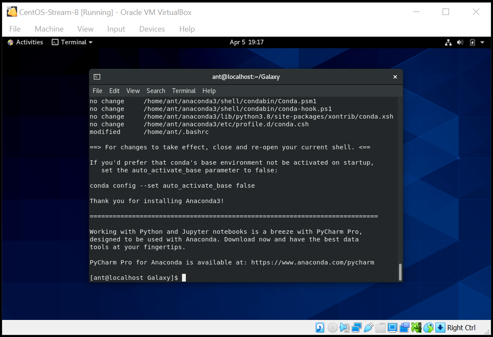
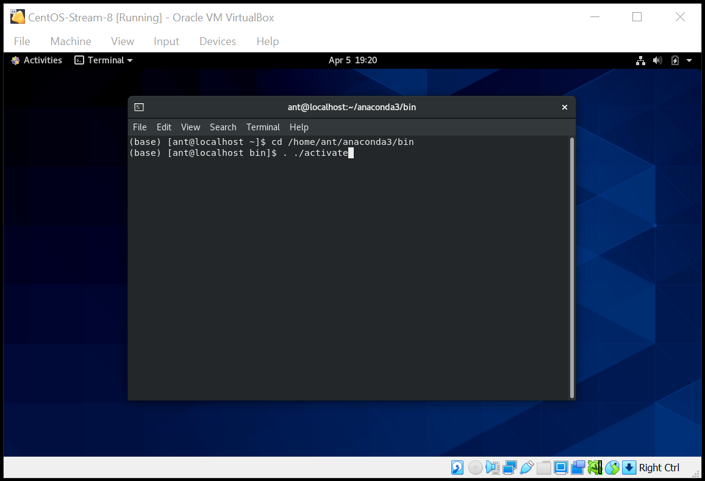
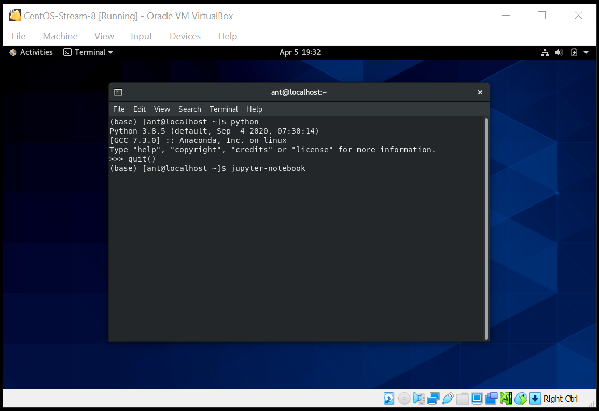
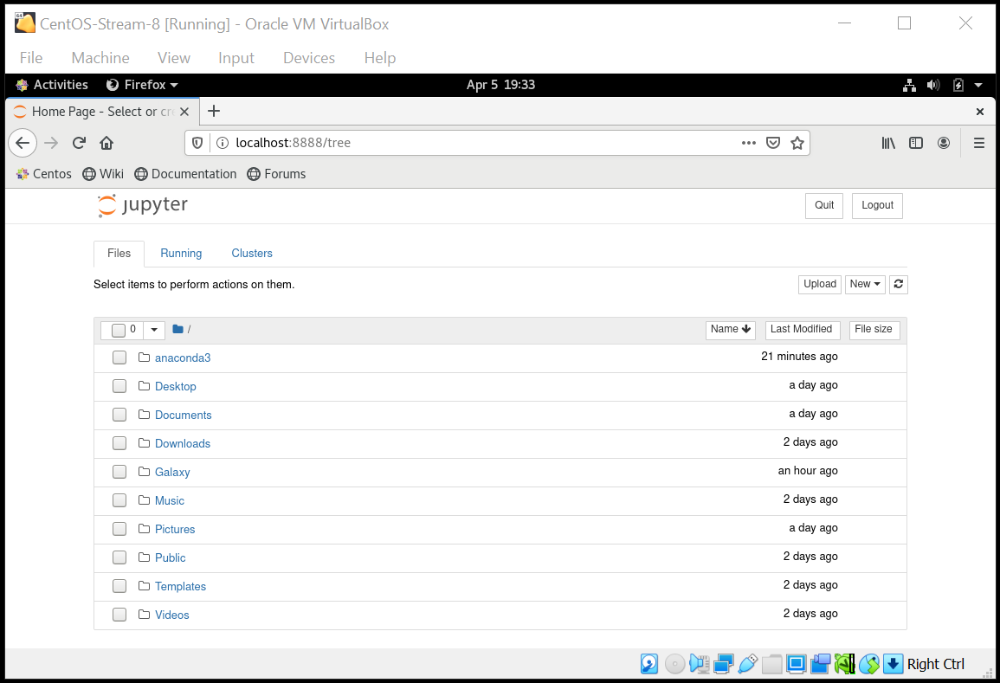
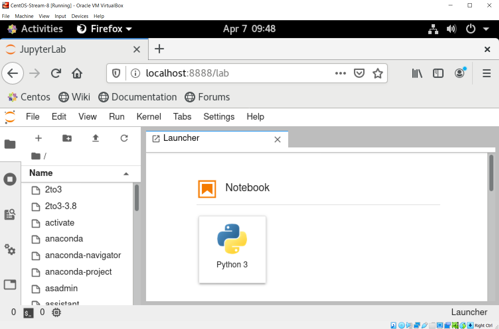
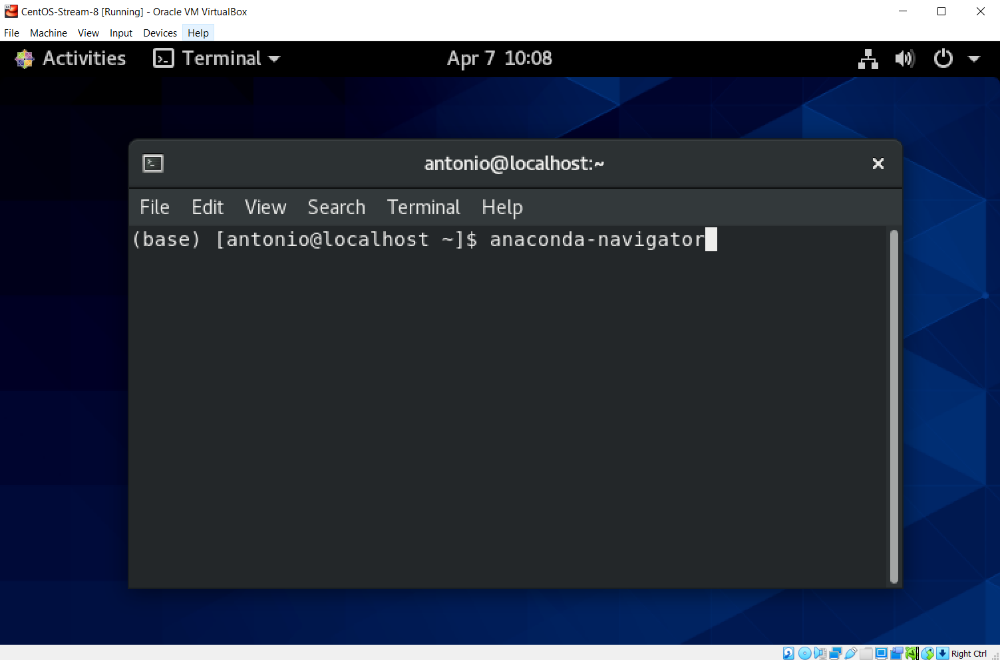
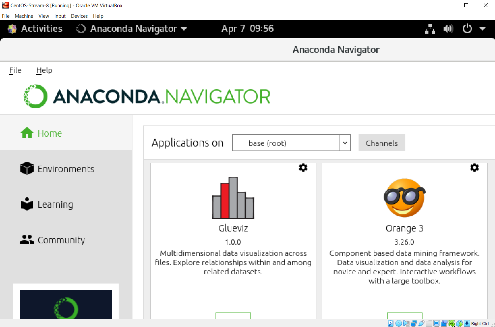
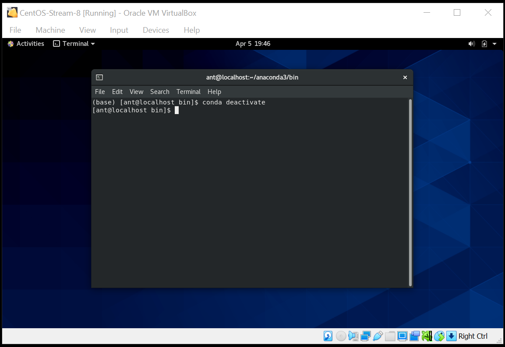

# Installing Anaconda in Linux
<br>

> The following are the instructions to install **Anaconda3** (version 2020.11) on Linux. The tutorial uses a **Linux CentOS-Stream-8** installed in a **VirtualBox** virtual machine 6.1.18, as described here: [Creating a CentOS-8 VM](https://github.com/mora-lab/installing/blob/main/virtualbox/tutorial_v1.0.md). A similar procedure can be followed by other OS.

## - Downloads
<br>

> 1. Go to your Linux machine. In our case, open the **VirtualBox** and start the VM.
<br>

<br>

<br>

> 2. Open a terminal and download **Anaconda3** latest version (currently, 2020.11) using:
```
curl -O https://repo.anaconda.com/archive/Anaconda3-2020.11-Linux-x86_64.sh
```
<br>

<br>

## - Installing Anaconda
<br>

> 3. Run the downloaded file by using:
```
bash Anaconda3-2020.11-Linux-x86_64.sh
```
<br>

<br>

> 4. Follow the installation procedure (accept license, location, etc).
<br>

<br>

<br>

<br>

<br>

## - Activate Anaconda
<br>

> 5. Go to the *bin* folder and activate **Anaconda**.
```
cd /home/username/anaconda3/bin
. ./activate
```
<br>

<br>

## - Check Anaconda's functionality
<br>

> 6. Test **python** version (3.8.5) and **Jupyter notebooks**.
<br>

<br>

<br>

> 7. Test **Jupyter Lab** and the **Anaconda Navigator**.
<br>

<br>

<br>

<br>

<br>

## - Deactivate
> 8. To leave the environment, use: `conda deactivate`
<br>

<br>

*Last updated: Antonio Mora, April 7th, 2021*
