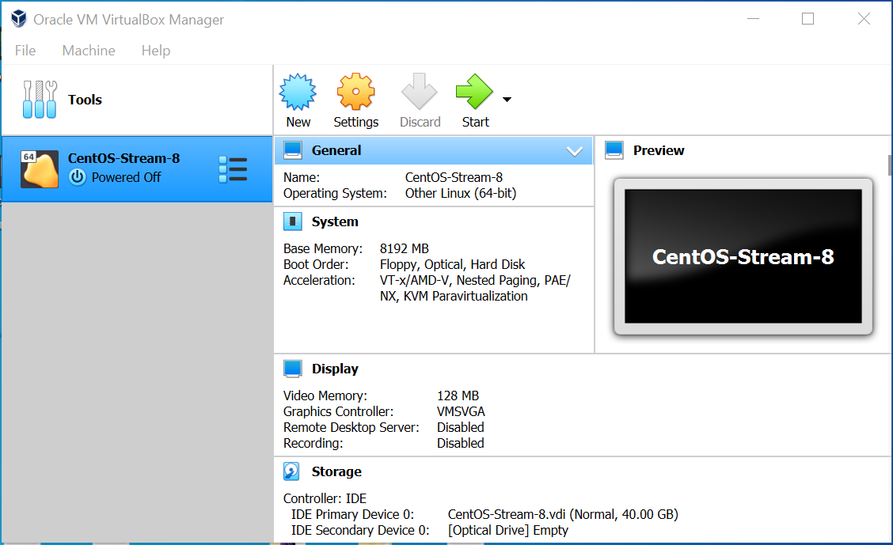
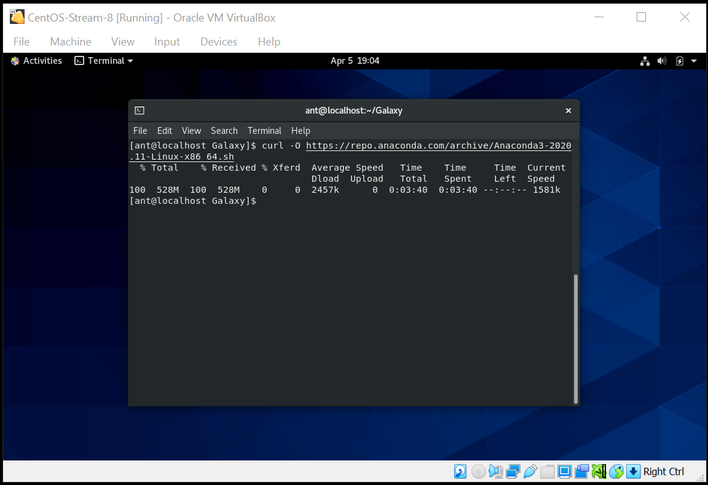
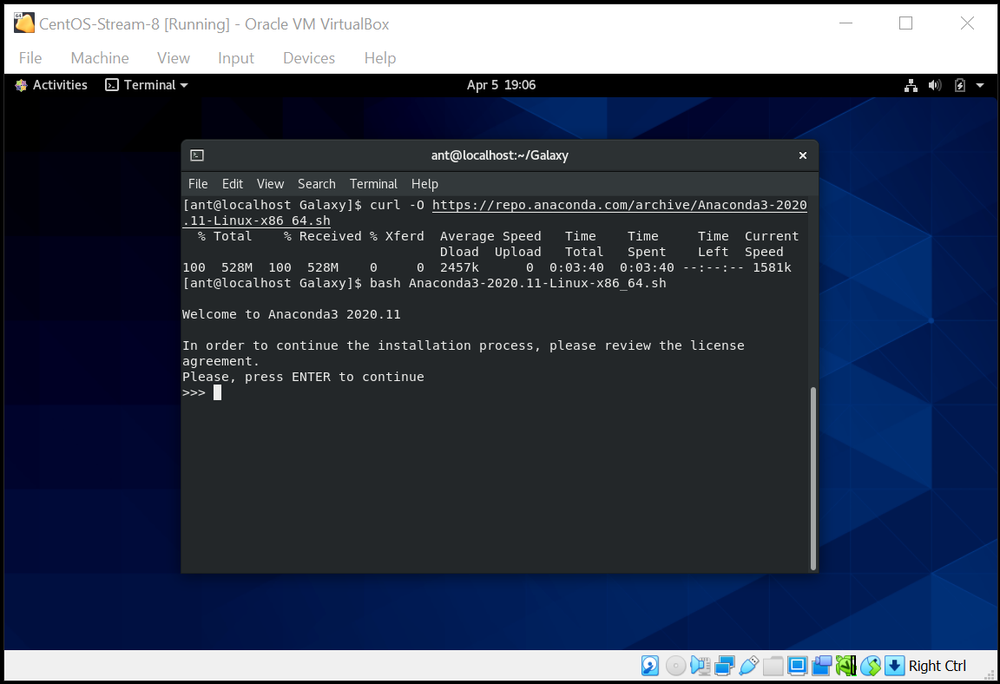
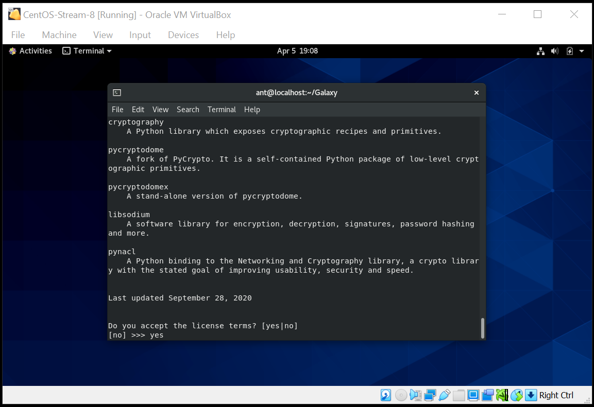

# Installing Docker and Galaxy Docker Images
<br>

> The following are the instructions to install **Docker** (version 20.10.6) and Galaxy Docker images on Linux. The tutorial uses a **Linux CentOS-Stream-8** installed in a **VirtualBox 6.1.18** virtual machine, as described here: [Creating a CentOS-8 VM](https://github.com/mora-lab/installing/blob/main/virtualbox/tutorial_v1.0.md). A similar procedure can be followed using other OS.

## - Pre-requisites
<br>

> 1. Go to your Linux machine. In our case, open the **VirtualBox** and create a new VM called **CentOS-Stream-8-Docker** with a "Dynamically allocated" hard disk (no fixed size; maximum size 300 GB) and the "Server with GUI" option (instead of Workstation), following the steps in the tutorial [Creating a CentOS-8 VM](https://github.com/mora-lab/installing/blob/main/virtualbox/tutorial_v1.0.md).
<br>

<br>

> 2. Open a terminal. Docker will go to the cs-root directory. Check the size of this folder.
```
df -h	# sudo lvdisplay
```

> 3. Connect to the Internet. Verify that you have **python**. If you don't, install it using:
```
curl -O https://repo.anaconda.com/archive/Anaconda3-2020.11-Linux-x86_64.sh
bash Anaconda3-2020.11-Linux-x86_64.sh
```
<br>

<br>

<br>

> 4. Follow the installation procedure (accept license, location, etc).
<br>

<br>

## - Installing Docker
<br>

> This is a summary of the process described at: https://docs.docker.com/engine/install/centos/

> 5. Uninstall old versions:
```
sudo dnf remove docker \
                  docker-client \
                  docker-client-latest \
                  docker-common \
                  docker-latest \
                  docker-latest-logrotate \
                  docker-logrotate \
                  docker-engine
```

> 6. Uninstall conflicts:
```
sudo dnf -y remove podman runc
```

> 7. Set up repository (note that this is the repository for Linux CentOS):
```
sudo dnf install -y yum-utils

sudo yum-config-manager \
    --add-repo \
    https://download.docker.com/linux/centos/docker-ce.repo
```

> 8. Install latest **Docker** (currently, 20.10.6) and **Containerd**:
```
sudo dnf install docker-ce docker-ce-cli containerd.io
#If prompted to accept the GPG key, verify that the fingerprint matches 060A 61C5 1B55 8A7F 742B 77AA C52F EB6B 621E 9F35, and if so, accept it.

docker version	# (Here, 20.10.6)
```

> Note: "Docker is installed but not started. The docker group is created, but no users are added to the group."

## - Start Docker:

> 9. Start Docker:
```
sudo systemctl start docker
```

> 10. Run the Hello-world image (if it doesn't exist, it will be downloaded):
```
sudo docker run hello-world
```

> 11. (Optional). Uninstalling:
```
sudo yum remove docker-ce docker-ce-cli containerd.io
```

> 12. (Optional). Try Docker image and container commands:
```
### With hello-world:
sudo docker images  # Look all images
sudo docker ps -a   # Look all containers
sudo docker rm my_container(f.ex., "priceless_volhard")  # Remove the only container
sudo docker rmi hello-world   # Now remove the only image

### With ubuntu:
sudo docker run -it ubuntu bash
ls
exit
sudo docker stop my_container(f.ex., objective_mirzakhani)
sudo docker start my_container(f.ex., objective_mirzakhani)
sudo docker rm my_container(f.ex., objective_mirzakhani)
sudo docker rmi ubuntu
```

## - Run Galaxy Docker images:

> 13. If you are interested in **Galaxy**, you can proceed to install it the hard way (see [here](https://github.com/mora-lab/installing/tree/main/galaxy)) or, alternatively, you can run the following **Docker** images (if they don't exist, they will be downloaded):
```
### Tutorial (27.9 MB):
sudo docker run -p 80:80 docker/getting-started
# Open browser (in CentOS) at localhost:80
sudo docker ps -a
sudo docker stop my_container(f.ex., infallible_black)

### Transcriptomics (33.7 GB):
sudo docker run -p 8080:80 quay.io/galaxy/transcriptomics-training
# Open browser at localhost:8080
sudo docker ps -a
sudo docker stop my_container(f.ex., unruffled_hoover)

### Epigenetics (14.4 GB):
sudo docker run -p 8080:80 quay.io/galaxy/epigenetics-training
# Open browser at localhost:8080
sudo docker ps -a
sudo docker stop my_container

### Metagenomics (15.6 GB):
sudo docker run -p 8080:80 quay.io/galaxy/metagenomics-training
# Open browser at localhost:8080
sudo docker ps -a
sudo docker stop my_container

### Proteomics (19.9 GB):
sudo docker run -p 8080:80 quay.io/galaxy/proteomics-training
# Open browser at localhost:8080
sudo docker ps -a
sudo docker stop my_container

### Metabolomics (10.2 GB):
sudo docker run -p 8080:80 quay.io/galaxy/metabolomics-training
# Open browser at localhost:8080
sudo docker ps -a
sudo docker stop my_container

### Statistics (10.6 GB):
sudo docker run -p 8080:80 quay.io/galaxy/statistics-training
# Open browser at localhost:8080
sudo docker ps -a
sudo docker stop my_container

df -h
```

## - Usage:

> 14. Use the **Docker** images in a few simple steps:
```
# Open Linux (here, VirtualBox and CentOS-Stream-8-Docker VM)
# Open a terminal
sudo systemctl start docker
sudo docker images
sudo docker ps -a
sudo docker run quay.io/galaxy/epigenetics-training	  # if it is already installed, it will just be opened
```

## - Final Notes:

> 15. From the tutorial: "Docker images are "read-only", all your changes inside one session will be lost after restart. This mode is useful to present Galaxy to your colleagues or to run workshops with it. To install Tool Shed repositories or to save your data you need to export the calculated data to the host computer. Fortunately, this is as easy as:
```
docker run -d -p 8080:80 \
    -v /home/user/galaxy_storage/:/export/ \
    bgruening/galaxy-stable
````

*Last updated: Antonio Mora, July 9th, 2021*
