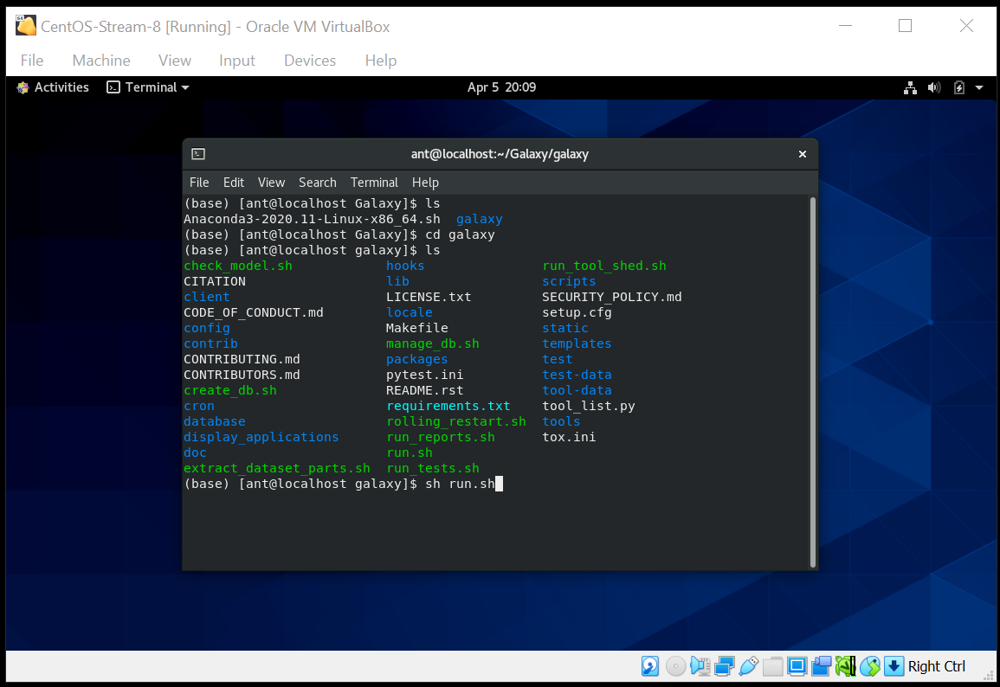

# Installing Galaxy

> The following are the instructions to install Galaxy in a CentOS-Stream-8 OS. Installation in similar environments follows similar steps.

## Pre-requisites

### If you are in Windows:
1. Create a Linux Virtual Machine. Follow the instructions here: [Creating a CentOS-8 VM](https://github.com/mora-lab/installing/tree/main/virtualbox).
2. Install Anaconda. Follow the instructions here: [Install Anaconda](https://github.com/mora-lab/installing/tree/main/anaconda).

### If you are in Linux:
1. Install Anaconda. Follow the instructions here: [Install Anaconda](https://github.com/mora-lab/installing/tree/main/anaconda).

### One more thing before starting...
Make sure that Anaconda's base environment is activated.
 

 

## - Install Galaxy using Git
 

> 1. Make a directory called "Galaxy".
 

 

> 2. Move to the folder you just created and install Git.
 

 

> 3. Get Galaxy using Git.
 

 

 

## - Running Galaxy
 

> 4. Move to the *Galaxy/galaxy* directory and run the *run.sh* file.
 

 

 

> 5. Open a web browser at *localhost:8080*.
 

 

*Last updated: Antonio Mora, April 7th, 2021*
