# Installing Java

**Java** is a high-level, multi-platform object-oriented programming language.<br><br>

## Java for windows:

### - Downloading:
> 1. Download Java from https://www.oracle.com/java/technologies/downloads/. For this tutorial, download **Java-11** from here: [jdk-11.0.11_windows-x64_bin.exe](https://www.oracle.com/java/technologies/downloads/#java11-windows). When you download Java, you will be asked to have an Oracle account and log in.
<br>

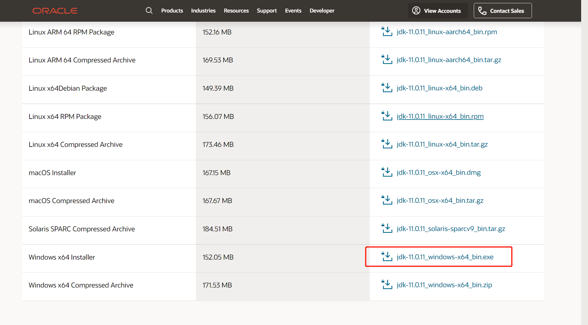

### - Installing:

> 2. Click on `jdk-11.0.11_windows-x64_bin.exe` to install Java and follow the instructions.
<br>

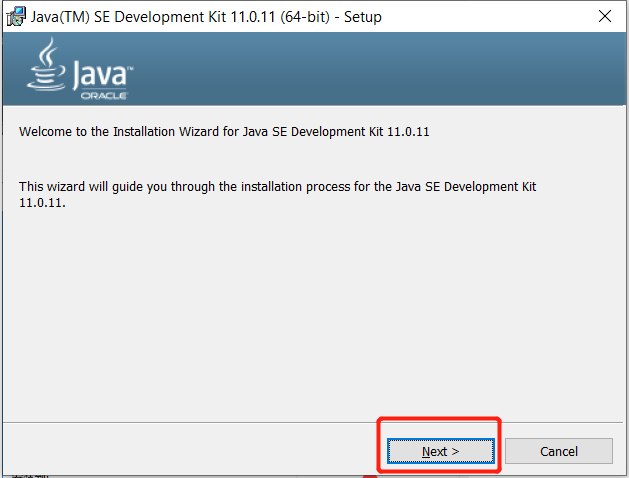

> **Note: You must remember the directory where you are installing Java, as we will use the path to set the environment variable for JAVA.**
<br>

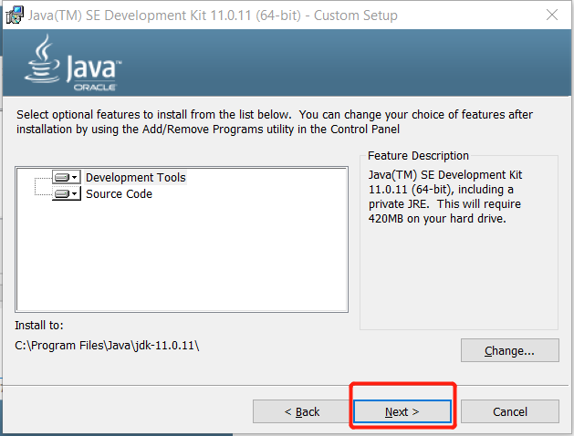
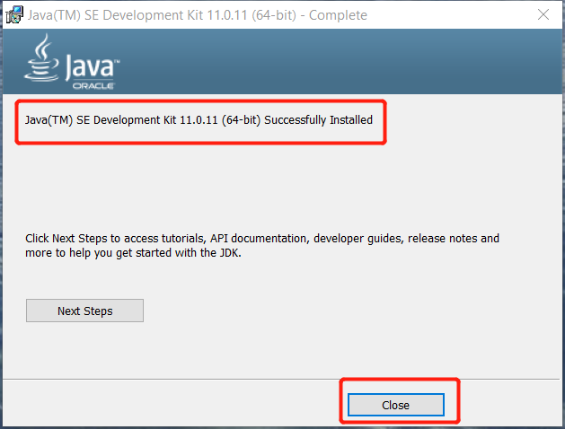

### - Setting the environment variables for Java 11:

> 3. Go to `This PC` -> `Properties` -> `Advanced system settings` (alternatively, press `Win + R` and input `sysdm.cpl`).
<br>

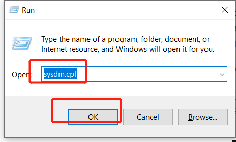

> 4. Go to the `Advanced` tab and click on `Environment Variables`.
<br>

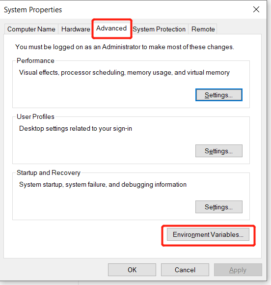

> 5. Click on `New...` to set a system variable for **JAVA 11**.
<br>

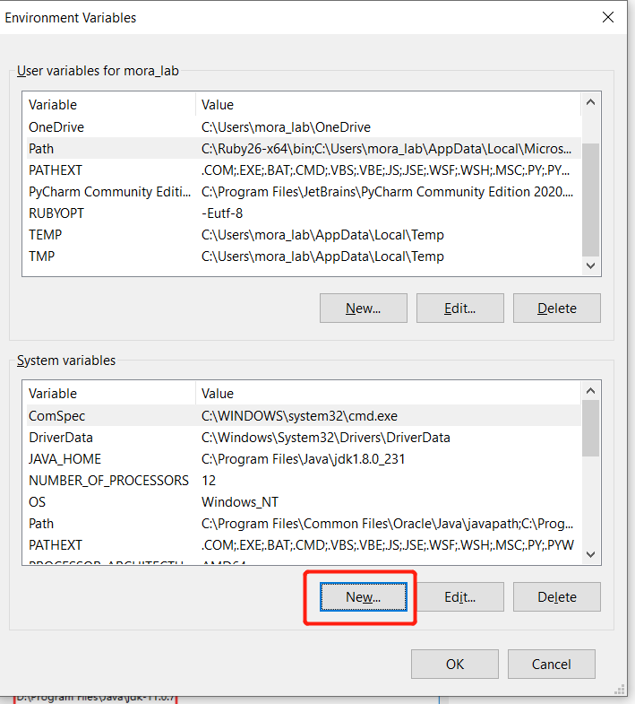

> 6. Set `Variable name` as `JAVA_HOME11` and `Variable value` as the path of installing JAVA (the path of JAVA in my computer is `C:\Program Files\Java\jdk-11.0.13`).
<br>

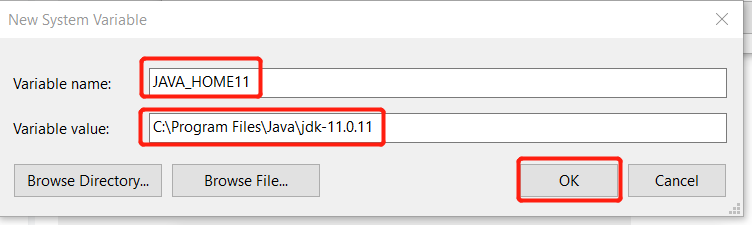

> 7. Now, click on `Path` in the list of `System variables` to add the JAVA variable. Then, click on `Edit...`.
<br>

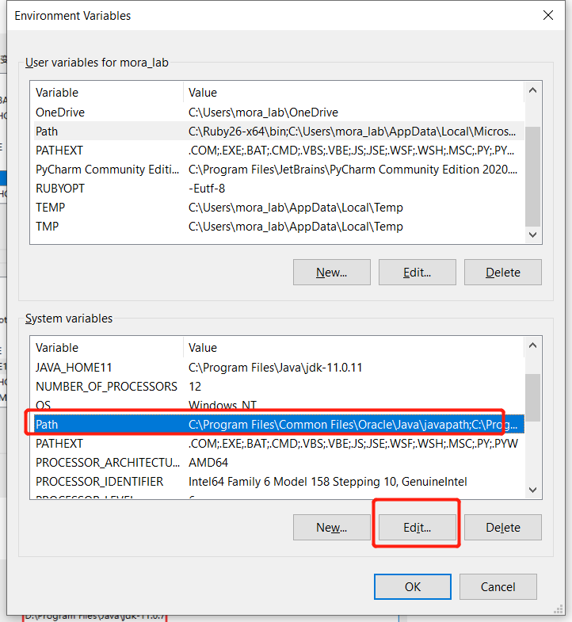

> 8. Click on `New` and write `%JAVA_HOME11%\bin`.
<br>


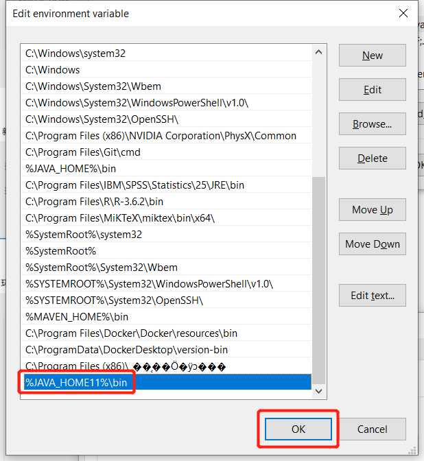
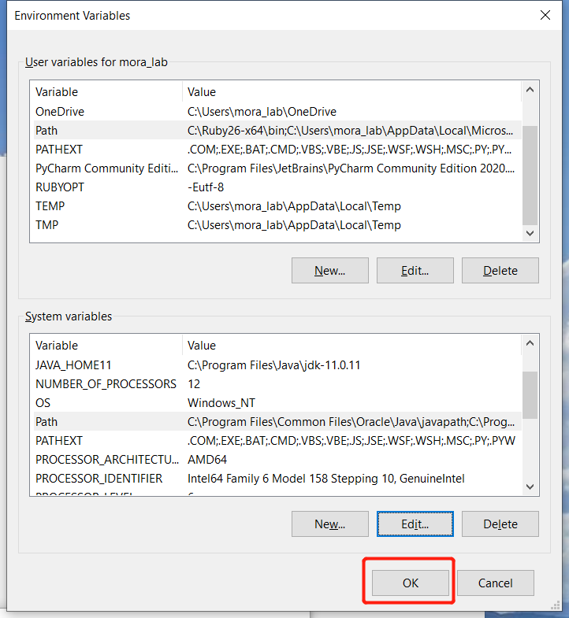

### - Testing:

> 9. Type `cmd` on the Windows search box. Open the **CMD** (Windows Command Prompt), and write the command `java --version`.
<br>

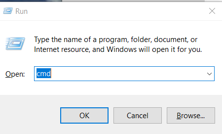
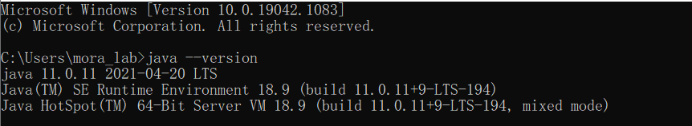

## Java for Linux CentOS:

> 11. To install java 11 on **CentOS**:
```
sudo yum install -y java-11-openjdk
sudo alternatives --config java
```

> 12. Choose the **java-11** option (the default might be an old `java-1.8` used by `libreoffice`).

> 13. Test the new version (now the default should be `java-11`).
```
java -version
```

*Last updated: Oct.30th, 2021*
