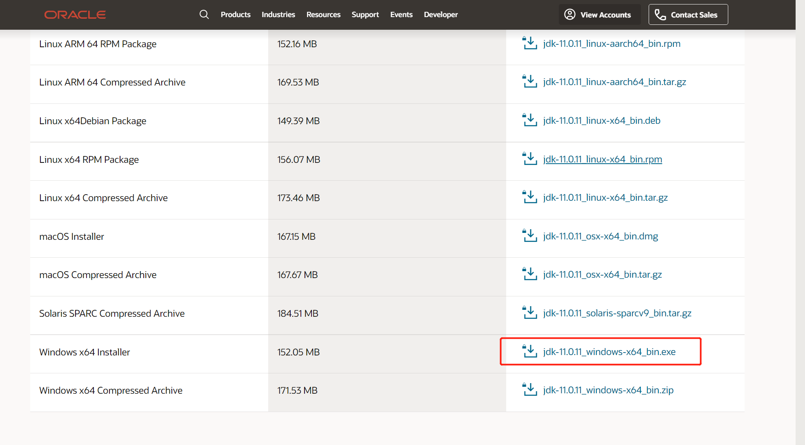
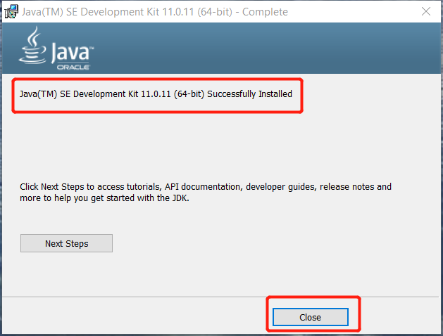
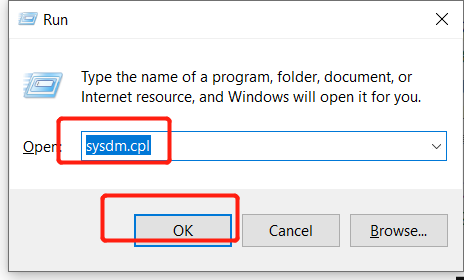
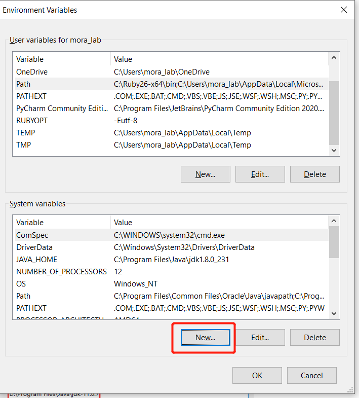
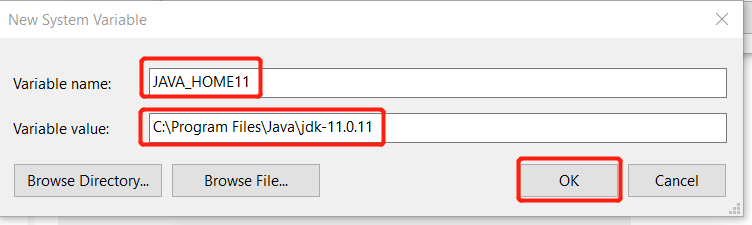
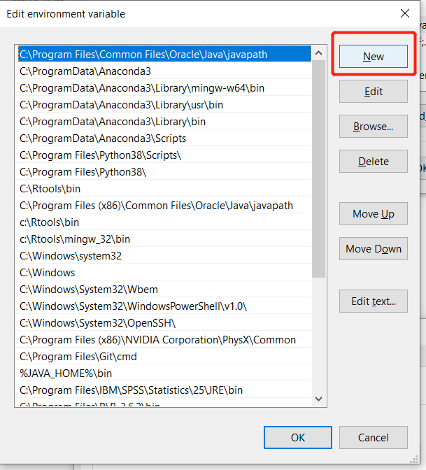
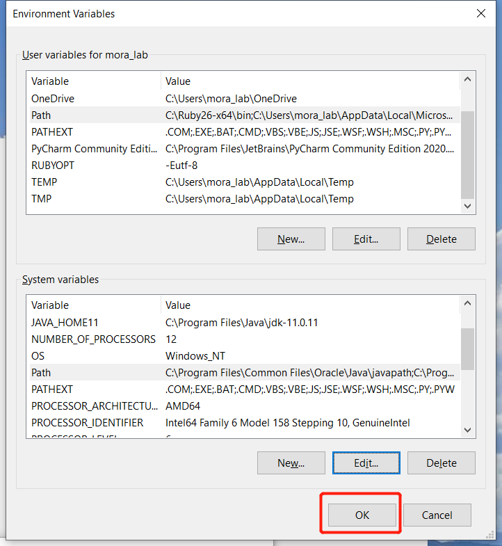

# Install Neo4j on Windows

## 1 Install Java

### (1) Download
Download Java [jdk-11.0.11_windows-x64_bin.exe](jdk-11.0.11_windows-x64_bin.exe) from https://www.oracle.com/java/technologies/javase-jdk11-downloads.html. When you download the Java file, you need to log in the Oracle.



### (2) Install

**click [jdk-11.0.11_windows-x64_bin.exe](jdk-11.0.11_windows-x64_bin.exe) to install following its guide.**


**Note: You must remember where the directory to install Java, because we will use the path to set the environment variable for JAVA.**




### (3) Set the environment variable for Java 11

**Press `Win + R` to quickly launch apps, and input `sysdm.cpl` to open `System Properties`.**



**Choose Advanced tab, and click the button `Environment Variables`.**


**Click `New...` Button to set a system variables for JAVA 11.**



**Set `Variable name` as `JAVA_HOME11` and `Variable value` as the path of installing JAVA (the path of JAVA in my computer is `C:\Program Files\Java\jdk-11.0.11`).**



**Now, you should click the `Path` in the list of  `System variable` to add the JAVA variable. Then, click the button `Edit...`.**


Click `New` Button to write `%JAVA_HOME11%\bin`.






### (4) Test the JAVA

**Open the CMD (Windows Command Prompt), and input the command `java --version` to test it.**

Press `Win + R` and input `cmd` to open CMD.


## 2. Install neo4j

> Now Neo4j has two different community server,  the tag `4.+` of neo4j can has many database in the one server, and the tag `3.+` of neo4j only has one database in the one server.

### 2.1 Install Neo4j 3.5.28

**(1) Download neo4j 3.5.28 from https://neo4j.com/download-center/#community **


**(2) Uncompress the downloaded file** [neo4j-community-3.5.28-windows.zip](neo4j-community-3.5.28-windows.zip) to `D:`.


Here in the installation directory, you'll find:

* **bin** - scripts and other executables

* **conf** - server configuration

* **data** - databases

* **lib** - libraries

* **plugins** - user extensions

* **logs** - log files

* **import** - location of files for LOAD CSV


**(3) In the CMD, input the following command to run neo4j**

```shell
D:
cd neo4j-community-3.5.28\bin
neo4j.bat console
```


**If you want to stop neo4j running, just press `Ctrl + C`.**

**(4) In a browser, open http://localhost:7474/**


**(5) Connect using the username 'neo4j' with default password 'neo4j'. You'll then be prompted to change the password.**


**(6) Introduce of neo4j browser**


Neo4j browser has a lot of practices for beginner.


### 2.2 Install Neo4j 4.3.2

**(1) Downlaod [neo4j 4.3.2](https://neo4j.com/artifact.php?name=neo4j-community-4.3.2-windows.zip) from https://neo4j.com/download-center/#community**


**(2) Uncompress the downloaded file** [neo4j-community-4.3.2-windows.zip](neo4j-community-4.3.2-windows.zip) to `D:`.


**(3) In the CMD, input the following command to run neo4j**

```shell
# go to the bin directory of neo4j-community
d:
cd D:\neo4j-community-4.3.2\bin

# run the neo4j
neo4j.bat console
```


**If you want to stop neo4j running, just press `Ctrl + C`.**

**(4) In a browser, open http://localhost:7474/**


**(5) Connect using the username 'neo4j' with default password 'neo4j'. You'll then be prompted to change the password.**


**(6) Introduce of neo4j browser**


# Install neo4j with Docker

neo4j docker official Images: https://hub.docker.com/_/neo4j

The raw files for building this neo4j images: https://github.com/neo4j/docker-neo4j

## 1 Docker

Docker installation can be see at https://docs.docker.com/get-docker/.

#### Docker Containers, Images and Registry relationships:

- Containers is the running Images
- Changing in Container with not change anything in Images
- Registry (docker hub) is storage the images in cloud
- One image can has many Containers, but one container is only for one image.
- `docker build ` is for building an Image
- `docker pull` is for download image from Registry.
- `docker run` is run the image as container


#### Docker Commands Diagram


## 2 Install neo4j with Docker

If you only want download neo4j images,use:

**Download the neo4j with TAG latest**

```shell
# default it will download the neo4j with TAG latest
docker pull neo4j
```


**Download neo4j with special TAG**

```shell
#download neo4j with special TAG， example, download neo4j 3.5.29-community
docker pull neo4j:3.5.29-community
```


More neo4j can be see at https://hub.docker.com/_/neo4j?tab=tags&page=1&ordering=last_updated

**List all images**

```shell
#list all images
docker images
```


> - **REPOSITORY**: the image name
> - **TAG**: the image version
> - **IMAGE ID**: the image ID
> - **CREATED**: create time
> - **SIZE**: the image size

**Run neo4j**

```shell
# run neo4j, default run the neo4j with latest Tag
docker run \
    --publish=7474:7474 --publish=7687:7687 \
    --volume=$HOME/neo4j/data:/data \
    --name neo4j-docker-test \
    neo4j
```

> - `--publish` set the port, the first `7474` is the port of host, the second `:7474` is the port of container. By default, we do not change the second `:7474`. If you don't want use `7474` of the host to set neo4j browser, you can set it as `--publish=4545:7474` to make `4545` as the port.
> - `--volume` is the argument to set a directory bind to the directory of container. `--volume=$HOME/neo4j/data:/data` set the `/data` of container bind to `$HOME/neo4j/data` of the host. If you change anything in the  `/data` of container, `$HOME/neo4j/data` of the host will also change the same of `/data`.  It is the same operation `$HOME/neo4j/data` in the host will be do in the /data of container.
> - `--name neo4j-docker-test` is set this container names `neo4j-docker-test`.
> - `neo4j` is the image name. If you want to run the neo4j with special tag, just use `neo4j:<tag>`. For example: `neo4j:3.5.29-community`


**Press `CTRL + C` to stop this neo4j container.**

After you run, it will make a folder of `neo4j/data` in the host.


```shell
# If you want to run neo4j in the backgroud, you need to add `-d` argument
docker run \
    --publish=7474:7474 --publish=7687:7687 \
    --volume=$HOME/neo4j/data:/data \
    -d \
    --name neo4j-docker \
    neo4j
```


Visit http://localhost:7474/ or http://host-ip:7474 .

If you want to access http://host-ip:7474 , you should open the `7474` port of the firewall in the host.


**Check the running neo4j or List all running containers**

```shell
# Check the running neo4j
# List all running containers
docker ps 
```


- **CONTAINER ID**: the container ID
- **IMAGE**: the image for this container
- **COMMAND** command when run this container
- **CREATED**:  created time
- **STATUS**: the container status
- **PORTS**: which ports exposed and can be access
- **NAME**: the container name


**List all containers**

```shell
# List all containers
docker ps -a
```


**Remove a container** 

```shell
# remove the container names neo4j-docker-test
docker rm -f neo4j-docker-test
```

> `interesting_shirley` is the container name, you can set a container special name will `--name` on `docker run`
>
> The second way is using `docker rm -f <containerID>` to delete a container

**Note:** You need to save your data before delete the container.


**The container inside**

```shell
# the container inside
# docker exec -it <containerID> <command>
# docker exec -it <containerNAME> <command>
docker exec -it neo4j-docker bash
```


use `exit` to exit the container.


**Stop the neo4j container**

```shell
# Stop the neo4j container
# docker stop <containerID>
# docker stop <containerNAME>
docker stop neo4j-docker
```


**Start the neo4j container**

```shell
# Start the neo4j container
# docker start <containerID>
# docker start <containerNAME>
docker start neo4j-docker
```


**Restart the neo4j container**

```shell
# restart the neo4j container
# docker restart <containerID>
# docker restart <containerNAME>
docker restart neo4j-docker
```

**Note**: when you start/restart the container, the container must exist.


**Remove all containers**

```shell
# remove all container
docker rm -f $(docker ps -aq)
```

**Note:** You need to save your data before delete the container.

**remove all images**

```shell
# remove all images
docker rmi -f $(docker images -aq)
```


# Neo4j Configuration

Neo4j configuration can set in the file `$NEO4J_HOME/conf/neo4j.conf`.

## 1 The default database

Neo4j database will be pull in `$NEO4J_HOME/data/databases` directory.

### `Neo4j 4.+`

```yaml
# The name of the default databases
dbms.default_database=neo4j
```

### `Neo4j 3.+`

```R
# The name of the database to mount
dbms.active_database=graph.db
```

##  2 Set the maximum memory

```yaml
# Java Heap Size: by default the Java heap size is dynamically
# calculated based on available system resources.
# Uncomment these lines to set specific initial and maximum
# heap size.
dbms.memory.heap.initial_size=512m
dbms.memory.heap.max_size=512m

# The amount of memory to use for mapping the store files.
# The default page cache memory assumes the machine is dedicated to running

# Neo4j, and is heuristically set to 50% of RAM minus the Java heap size.
dbms.memory.pagecache.size=10g

# Limit the amount of memory that all of the running transaction can consume.
# By default there is no limit.
dbms.memory.transaction.global_max_size=256m

# Limit the amount of memory that a single transaction can consume.
# By default there is no limit.
dbms.memory.transaction.max_size=16m
```

In this tutorial, I suggest memory larger than default.

```yaml
# For example, we set memory is 10GB
dbms.memory.heap.initial_size=10g
dbms.memory.heap.max_size=10g
```

## 3 Default directory for `LOAD CSV`

Default directory for `LOAD CSV` is `$NEO4J_HOME/import`.

```yaml
# This setting constrains all `LOAD CSV` import files to be under the `import` directory. Remove or comment it out to
# allow files to be loaded from anywhere in the filesystem; this introduces possible security problems. See the
# `LOAD CSV` section of the manual for details.
dbms.directories.import=import
```

## 4 Network configuration

Remote access:

```yaml
# With default configuration Neo4j only accepts local connections.
# To accept non-local connections, uncomment this line:
dbms.connectors.default_listen_address=0.0.0.0
```

Change the port:

```yaml
# Bolt connector
dbms.connector.bolt.enabled=true
#dbms.connector.bolt.tls_level=OPTIONAL
dbms.connector.bolt.listen_address=:7687

# HTTP Connector. There can be zero or one HTTP connectors.
dbms.connector.http.enabled=true
dbms.connector.http.listen_address=:7474

# HTTPS Connector. There can be zero or one HTTPS connectors.
dbms.connector.https.enabled=true
dbms.connector.https.listen_address=:7473
```

Neo4j worker threads：

```yaml
# Number of Neo4j worker threads.
#dbms.threads.worker_count=
```

## 5 Plugins configuration

plugins should be put in the folder `$NEO4J_HOME/plugins`.

```yaml
# A comma separated list of procedures and user defined functions that are allowed
# full access to the database through unsupported/insecure internal APIs.
#dbms.security.procedures.unrestricted=my.extensions.example,my.procedures.*

# A comma separated list of procedures to be loaded by default.
# Leaving this unconfigured will load all procedures found.
#dbms.security.procedures.whitelist=apoc.coll.*,apoc.load.*
```

Example: add `apoc` and `algo` plugins.

```yaml
dbms.security.procedures.unrestricted=algo.*,apoc.*
```

## 6 Only allow read operations from this Neo4j instance

```yaml
# Only allow read operations from this Neo4j instance. This mode still requires
# write access to the directory for lock purposes.
#dbms.read_only=false 
```

only Allow read operations set it as:

```yaml
dbms.read_only=true
```

# Install Neo4j on Linux CentOS


## First steps
* Open Linux
* Verify Internet connection

## Install java 11:
```
sudo yum install -y java-11-openjdk
sudo alternatives --config java
# Choose the java-11 option (the default is an old java-1.8 used by libreoffice)
java -version # now the default should be java-11
```

## Install cypher-shell:
```
curl -O https://dist.neo4j.org/cypher-shell/cypher-shell-4.2.2-1.noarch.rpm
sudo rpm -U cypher-shell-4.2.2-1.noarch.rpm
```

## Install neo4j:
```
curl -O https://dist.neo4j.org/rpm/neo4j-4.2.2-1.noarch.rpm
sudo rpm -U neo4j-4.2.2-1.noarch.rpm
neo4j version	# 4.2.2
```

## Start neo4j:
```
sudo systemctl daemon-reload
sudo neo4j start
```

Open a web browser at localhost:7474

## Connecting from outside:
When connecting from the outside, set the following:
```
sudo vi /etc/neo4j/neo4j.conf
```
```
dbms.connector.bolt.address=0.0.0.0:7687
dbms.connector.https.address=<IP address of the server>:7474
```
That will open the 7678 and 7474 ports.

*last reviewed: Jul.16th, 2021*
