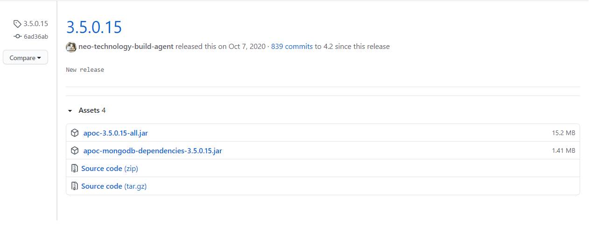
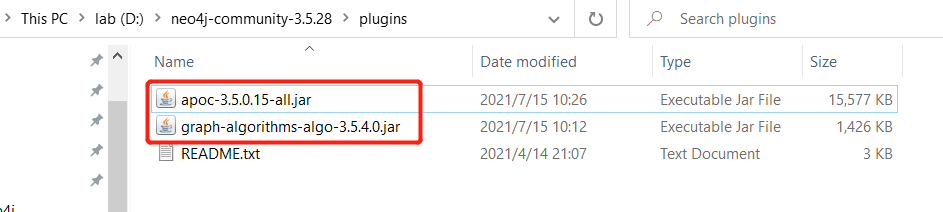
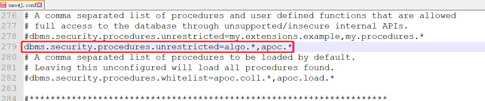
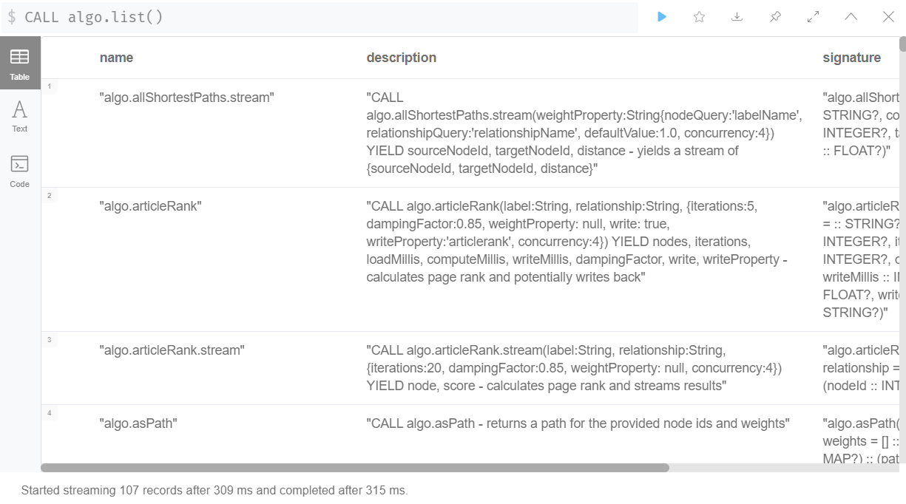
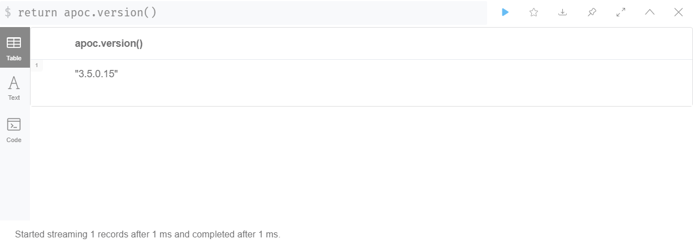

# Installing algo and apoc 

**Algo** and **Apoc** are two graph-theory libraries / plugins that can be added to **neo4j**.

## Installing:

> 1. Download `graph-algorithms-algo-[version].jar` from [the matching release](https://github.com/neo4j-contrib/neo4j-graph-algorithms/releases) and copy it into the `$NEO4J_HOME/plugins ` directory. We can work out which release to download by referring to the versions file.
<br>
> Download `apoc-[version-all].jar` from [the matching release](https://github.com/neo4j-contrib/neo4j-apoc-procedures/releases/) and copy it into the `$NEO4J_HOME/plugins ` directory. We can work out which release to download by referring to the versions file.

<br><br>

<br><br>

**Note: You must download the release versions file which applies to your neo4j.  Otherwise, neo4j will not start.**

## Settings:

> 2. Add the following to your `$NEO4J_HOME/conf/neo4j.conf` configuration file:

```bash
dbms.security.procedures.unrestricted=algo.*,apoc.*
```

<br><br>

> We need to give the library unrestricted access because the algorithms use the lower level Kernel API to read from, and to write to Neo4j.<br>

> 3. Restart Neo4j.
<br>

## Testing:

> 4. Verifying installation:

> Once we’ve installed the library, to see a list of all the algorithms, run the following query:

```cypher
CALL algo.list()
```

<br><br>

```cypher
return apoc.version()
```

<br><br>

## Usage:

*Last updated: Nov.9th, 2021*
