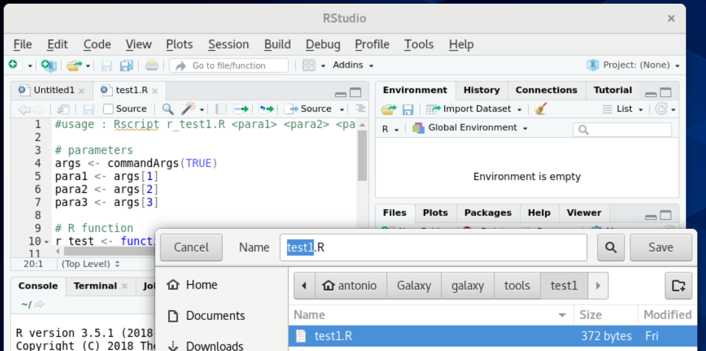
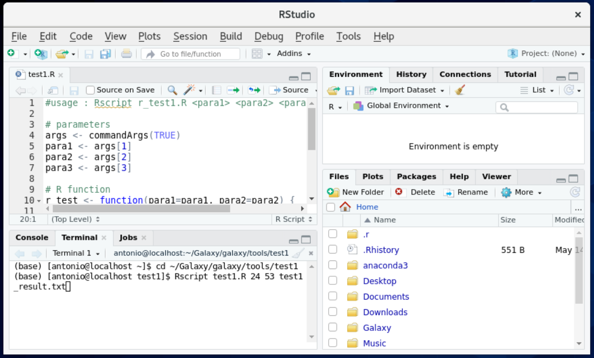
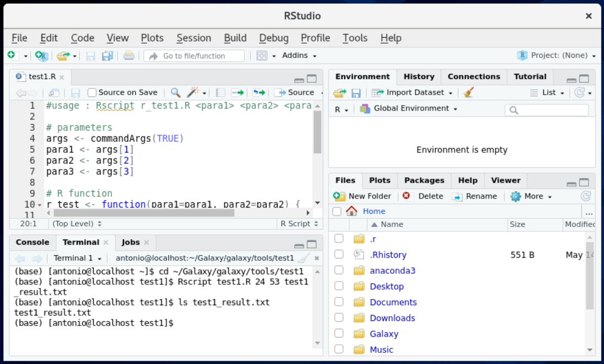
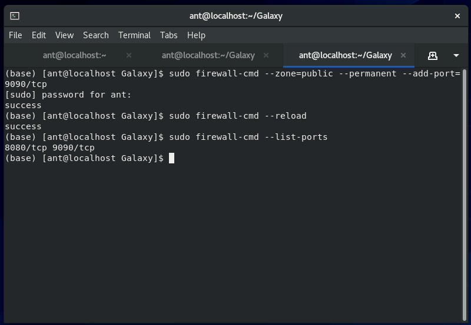
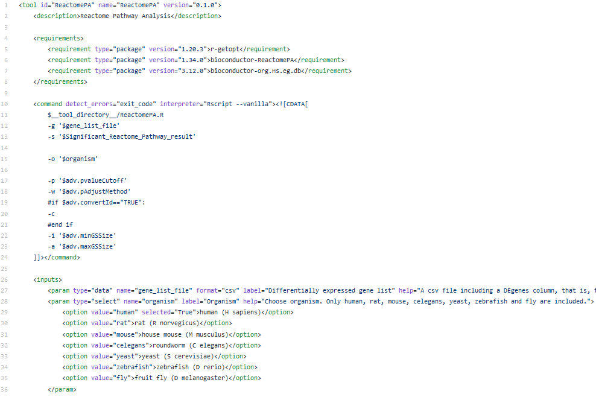
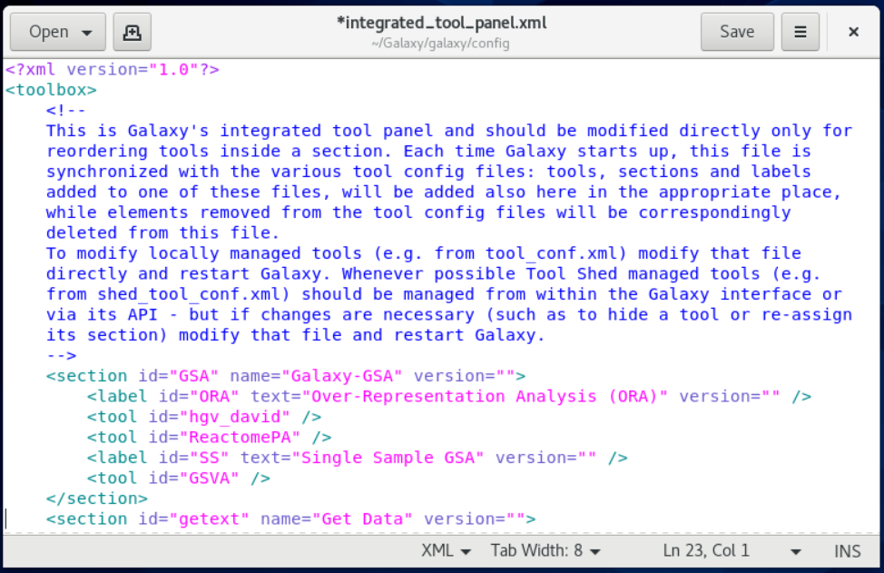

# Creating Galaxy tools using Planemo
<br>

> **Planemo** is a command-line utility "to assist in developing **Galaxy** and Common Workflow Language artifacts - including tools, workflows, and training materials". More information about **Planemo** can be found [here](https://planemo.readthedocs.io/en/latest/readme.html).

> The following are the instructions to install **Planemo** (version 0.74.3) on Linux. The tutorial uses a **Linux CentOS-Stream-8** installed in a **VirtualBox 6.1.18** virtual machine. A similar procedure can be followed using other OS.

## - Before starting
<br>

> 1. In order to install Planemo, you must previously have installed **python**, **Galaxy** and **R/Rstudio** in a Linux environment.
If you don't have them installed yet, follow our tutorials:

[(i) Creating a CentOS-Stream-8 VirtualBox VM](https://github.com/mora-lab/installing/blob/main/virtualbox/tutorial_v1.0.md)<br>
[(ii) Installing Anaconda](https://github.com/mora-lab/installing/blob/main/anaconda/tutorial_v1.0.md)<br>
[(iii) Installing Galaxy](https://github.com/mora-lab/installing/blob/main/galaxy/tutorial_v1.0.md)<br>
[(iv) Installing Rstudio](https://github.com/mora-lab/installing/blob/main/rstudio/tutorial_v1.0.md)<br>

> If you have them installed, please verify that you are in the conda base environment.

> 2. Go to your Linux machine. In our case, open **VirtualBox** and start the VM. Open a terminal in your Linux environment.

## - Download and install
<br>

> 3. Download and install Planemo from conda.
```
conda config --add channels bioconda
conda config --add channels conda-forge
conda install planemo
```

<br>

<br>

<br>

<br>

> 4. Verify the version of **Planemo** that you have installed (in our case, it is Planemo v0.74.3).

<br>

<br>

## - Build an R test tool:

> 5. Open **Rstudio**.

<br>

<br>

> 6. Create an R script that inputs two parameters and passes them to the output.
```
#usage : Rscript r_test1.R <para1> <para2> <para3>

# parameters
args<-commandArgs(TRUE)
para1 <- args[1]
para2 <- args[2]
para3 <- args[3]

# R function
r_test <- function(para1 = para1, para2 = para2){
	x = paste0("Parameter1 is:", para1, ". Parameter2 is:", para2)
	return(x)
}

# example
x <- r_test(para1 = para1, para2 = para2)

# output
write.table(x, file = para3)
```

<br>

<br>

> *commandArgs()* provides access to a copy of the command line arguments supplied when this R session vas invoked.

> 7. Save it as `galaxy/tools/test1/test1.R`.

<br>

<br>

> 8. Open a terminal in **Rstudio** and run the **R** script.
```
cd ~/Galaxy/galaxy/tools/test1/
Rscript test1.R 24 53 test1_result.txt
```

<br>

<br>

> 9. Verify that you obtained the result file.

<br>

<br>

> 10. You can also open the result file using **Rstudio**.

<br>

<br>

## - Use Planemo to create the tool definition file:

> The Galaxy tool definition file is an XML file wrapping a tool written in another language. The XML file describes the user interface for the tool, how to invoke it, what options to pass, and what files it will produce as output. It does contain multiple tags and attributes. More information about the XML tool definition file can be found [here](https://docs.galaxyproject.org/en/latest/dev/schema.html).

> 11. Run the following command in a terminal to build a tool based on our **R** function.
```
planemo tool_init --force \
--id 'test1' \
--name 'Test R tool to pass parameters' \
--description 'Test R tool to pass parameters' \
--example_command 'Rscript test1.R 24 53 test1_result.txt' \
--example_input 24 \
--example_input 53 \
--example_output 'test1_result.txt' \
--requirement 'r-base@3.5.1' \
--test_case
```

<br>

<br>

> 12. Verify that the **test1.xml** file has been created. You can open this file in **Rstudio** to review its content.

<br>

<br>

<br>


> 13. Modify: (i) the *Rscript* command, (ii) the input arguments, and (iii) the help in the XML file, as described:
```
<tool id="test1" name="My first Galaxy tool" version="0.1.0" python_template_version
<description>Pass parameters to R and generate a text file with them</description
<requirements>
<requirement type="package" version="3.5.1">r-base</requirement>
</requirements>
<command detect_errors="exit_code"><![CDATA[
	Rscript $__tool_directory__/test1.R '$input1' '$input2' '$output1'
]]></command>
<inputs>
<param type="text" name="input1" value="" label="Label for the first parameter"
<param type="text" name="input2" value="" label="Label for the second parameter"
</inputs>
<outputs>
<data name="output1" format="txt" />
</outputs>
<tests>
<test>
<param name="input1" value="24"/>
<param name="input2" value="53"/>
<output name="output1" file="test1_result.txt"/>
</test>
</tests>
<help><![CDATA[
	#Usage : Rscript test1.R <para1> <para2> <output_file>
	<para1> and <para2> are text
	<output_file> is a text file
]]></help>
</tool>
```

<br>

<br>

The following is a link to help us write attributes for all kinds of parameters: [Link](https://docs.galaxyproject.org/en/latest/dev/schema.html#tool-inputs-param).

## - Update Galaxy:

> 14. Go to *Galaxy/galaxy/config* and create the file **tool_data_table_conf.xml** from the original **tool_data_table_conf.xml.sample**
```
cd config
cp tool_data_table_conf.xml.sample tool_data_table_conf.xml
ls tool_data*
```

<br>

<br>

> 15. Open the port *9090* for Galaxy Planemo.
```
sudo firewall-cmd --zone=public --permanent --add-port=9090/tcp
sudo firewall-cmd --reload 
sudo firewall-cmd --list-ports
```

<br>

<br>

## - (Optional). Use Planemo to test the tool:

> 16. Test the tool using *planemo s*.
```
planemo s --galaxy_root /home/ant/Galaxy/galaxy \
--galaxy_python_version 3.6 \
--host 0.0.0.0 \
--port 9090
```
> (This command may take a long time)

<br>

<br>

> 17. Open *localhost:9090* with a web browser.

<br>

<br>

> 18. Find the tool called *'Test how to pass parameters for R'*. You can see that the labels and boxes correspond to the XML file.

<br>

<br>

<br>

## - Make Galaxy aware of the new tool and build the tool menus:
<br>

> Assuming that the tool is ready, now we can "make Galaxy aware of the new files". Galaxy recognizes installed tools through the `tool_conf.xml` configuration file located in the `config/` directory. Therefore, new tools can be added to existing or new sections in the following way:

> 19. Open the tool configuration file using either (i) a terminal and **vim** editor or (ii) CentOS's **File Manager** and **Text Editor**:
<br>
> (i) Using **vim**:
```
cd ~/Galaxy/galaxy/config
vim tool_conf.xml
```
<br>

<br>

> (ii) Using **Text Editor**:
<br>

<br>

> 20. For the tool in *"galaxy/tools/test1/test1.R"*, insert the following text:
```
 <section name="test1" id="t1">
    <tool file="test1/test1.xml" />
 </section>
```
> Using the **vim** editor: Press `i` to edit. Add the text after the last `</section>` of the file. To save and leave **vim**, press `Esc` and then `:x`.
<br>

<br>

<br>

> Using Text Editor should be straightforward.

## - Start Galaxy:

> 21. To test the newly integrated tool, start Galaxy by typing `sh run.sh` from the Galaxy root directory and point your browser to `http://localhost:8080`.
```
cd ~/Galaxy/galaxy
sh run.sh
```
<br>

<br>

<br>

> Find the tool called *'Test how to pass parameters for R'* in the new *'test1'* menu section.

## - Run the new tool:

> 22. Add values to both parameters and run the tool. You will see a new history element appears with our results.

<br>

<br>

<br>

<br>

## - Installing entire packages:
<br>
> If we don't want to wrap a simple one-file script but an entire existing package, we can create a script that calls the package (and its dependencies), and defines the inputs, the functions of the package to be run, and the outputs. That script must be associated to an xml file as we have done before. In this tutorial, we will show how to wrap existing R packages, by wrapping the [ReactomePA](https://doi.org/doi:10.18129/B9.bioc.ReactomePA) and [GSVA](https://doi.org/doi:10.18129/B9.bioc.GSVA) R packages into Galaxy.

> 23. Create a folder called **"GalaxyGSA"** for this project.
```
cd ~/Galaxy/galaxy/tools
mkdir GalaxyGSA
```
<br>

<br>

> 24. Open `Rstudio` and create the following **R** scripts: [ReactomePA.R](scripts/ReactomePA.R) and [GSVA.R](scripts/GSVA.R). Save them to the galaxy tool folder ("galaxy/tools/GalaxyGSA/ReactomePA.R" and "galaxy/tools/GalaxyGSA/GSVA.R" respectively).
```
rstudio
```
<br>

<br>

> 25. Also, create the following **xml** files: [ReactomePA.xml](scripts/ReactomePA.xml) and [GSVA.xml](scripts/GSVA.xml). Save them to the galaxy tool folder ("galaxy/tools/GalaxyGSA/ReactomePA.xml" and "galaxy/tools/GalaxyGSA/GSVA.xml" respectively).
<br>

<br>

> Note that an important part of these files is the list of requirements. For example, **ReactomePA.xml** lists the following R packages: `r-getopt`, `bioconductor-ReactomePA`, and `bioconductor-org.Hs.eg.db`, while **GSVA.xml** lists `bioconductor-GSVA`, `r-pheatmap`, and `r-getopt`.

> 26. Now update the `galaxy/config/tool_conf.xml` file by adding:
```
 <section name="GalaxyGSA" id="GSA">
    <label text="ORA" id="ORA" />
    <tool file="GalaxyGSA/reactomePA/ReactomePA.xml" />
    <label text="SS" id="SS" />
    <tool file="GalaxyGSA/GSVA/GSVA.xml" />
 </section>
```
<br>

<br>

<br>

> 27. Run Galaxy. You can see the new section and tools in the left-side menu.
```
cd ~/Galaxy/galaxy
sh run.sh
```
<br>

<br>

<br>

> 28. If you want to change the order of the tools in the menu, close Galaxy and modify the `integrated_tool_panel.xml` file in the `config` folder. Here, we made changes by using CentOS **Text Editor**.
> Just re-arrange the different sections in the order you wish.
<br>

<br>

<br>

> 29. Install packages: Run Galaxy. In the Galaxy menu, go to `Admin` -> `Manage Dependencies(legacy)` and find your packages in the list. Proceed to install all your **R** packages and dependencies by selecting all of them and then pressing "Install checked dependencies using Conda".
```
cd ~/Galaxy/galaxy/
sh run.sh
```
<br>

<br>

<br>

> 30. That's it. Restart Galaxy and test your tools.
<br>

<br>

<br>

## - Extra:
<br>
> If you wish to modify Galaxy's welcome page, go to the `galaxy/static` folder and make the changes to the `welcome.html` file. If you add figures to the `welcome.html` file, place them in the `static/images` folder.

<br>

<br>

<br>

<br>

*Last updated: Antonio Mora, May 18th, 2021*
