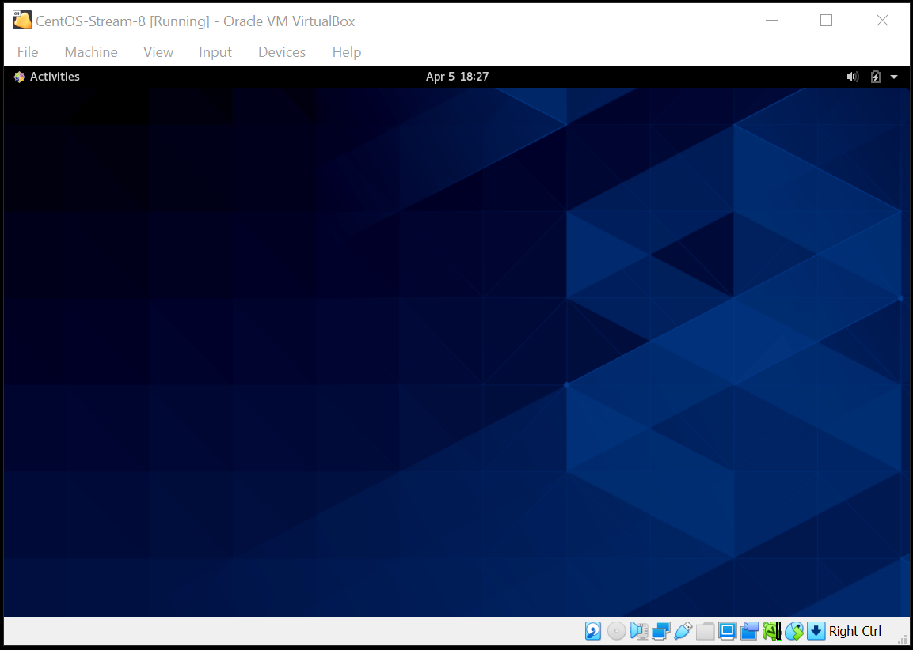

# Installing RStudio in Linux
<br>

> The following are the instructions to install **RStudio** on Linux. The tutorial uses a **Linux CentOS-Stream-8** installed in a **VirtualBox** virtual machine 6.1.18, as described here: [Creating a CentOS-8 VM](https://github.com/mora-lab/installing/blob/main/virtualbox/tutorial_v1.0.md). A similar procedure can be followed by other OS.

## - Download and install R
<br>

> 1. Go to your Linux machine. In our case, open the **VirtualBox** and start the VM.
<br>

<br>

<br>

> 2. Open a terminal and download **R**. There are several alternative ways to do this (using either *dnf*, *yum*, *conda*, and others), but here we wil use `conda` (note: given that we are using `conda`, it is also recommended to install the R packages via `conda`).
```
conda install R
```
<br>

<br>

<br>

> 3. Check R version (in our case, it is 3.5.1).
```
R --version
```
<br>

<br>

## - Download and install RStudio
<br>

> 4. We have two options: Either downloading **RStudio-Desktop** or **RStudio-Server**. The code in each case is shown below but in this tutorial we will only follow the first case (RStudio-Server will be discussed in a different tutorial).
```
wget https://download1.rstudio.org/desktop/centos8/x86_64/rstudio-1.4.1106-x86_64.rpm
sudo yum install rstudio-1.4.1106-x86_64.rpm
```
```
wget https://download2.rstudio.org/server/centos8/x86_64/rstudio-server-rhel-1.4.1106-x86_64.rpm
sudo yum install rstudio-server-rhel-1.4.1106-x86_64.rpm
```
<br>

<br>

> 5. Run **RStudio**.
<br>

<br>

<br>

*Last updated: Antonio Mora, April 8th, 2021*
