# Installing Oracle VM VirtualBox
 

> The following are the instructions to install a virtual machine (VM) in **Windows 10** (now referred as the "host" operative system). The chosen virtual machine is **VirtualBox 6.1.34**.

## - Downloads
 

> 1. Download VirtualBox from their website: [Virtual Box](https://download.virtualbox.org/virtualbox/6.1.34/VirtualBox-6.1.34-150636-Win.exe) and [VBox extension pack](https://download.virtualbox.org/virtualbox/6.1.34/Oracle_VM_VirtualBox_Extension_Pack-6.1.34.vbox-extpack).

## - Installing VirtualBox
 

> 2. Run VirtualBox installation file. After running, you will receive a welcome message giving start to the installation process.

 
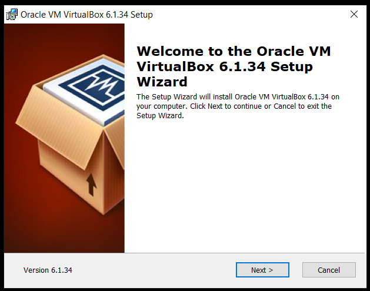
 

> 3. Choose your desired location and other options.

 
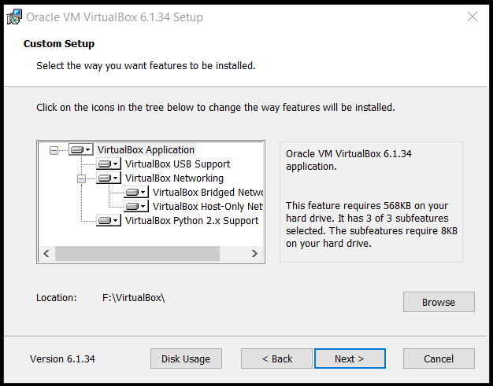
 
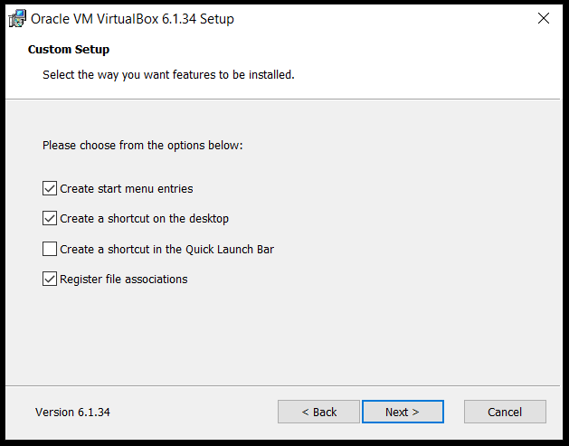
 
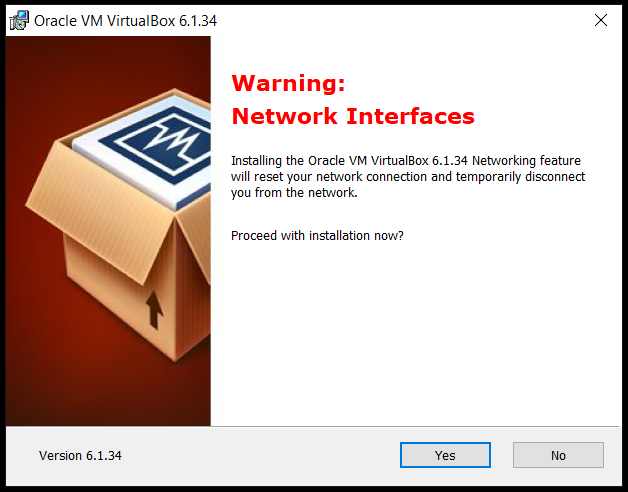
 
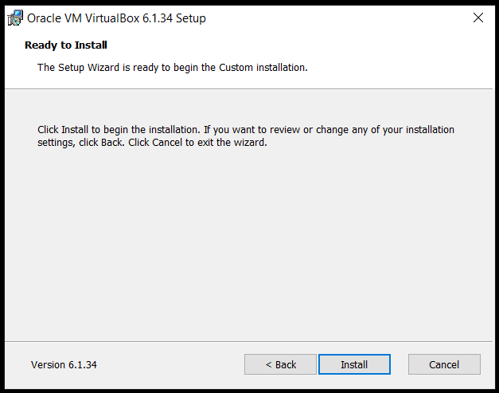
 

> 4. After this, VirtualBox will be installed.

 
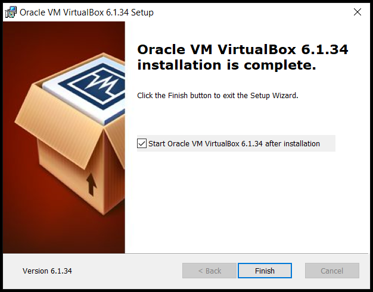
 
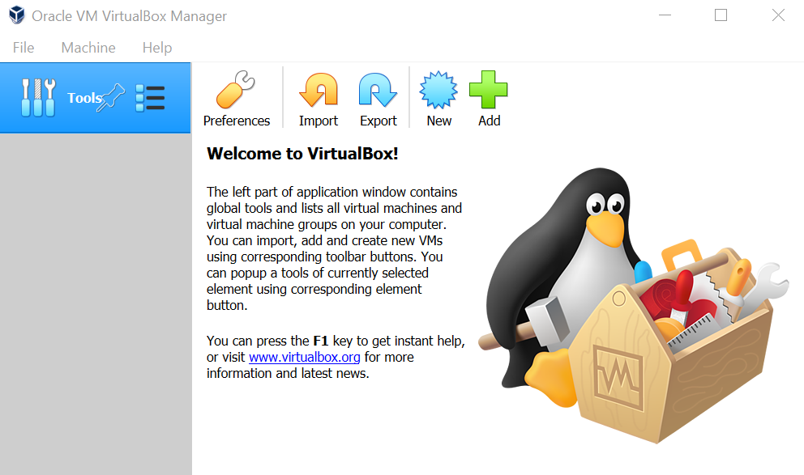
 

## - Installing the extension pack
 

> 5. To add the VBox extension pack, click on **"Preferences"** and find the file we previously downloaded.

 
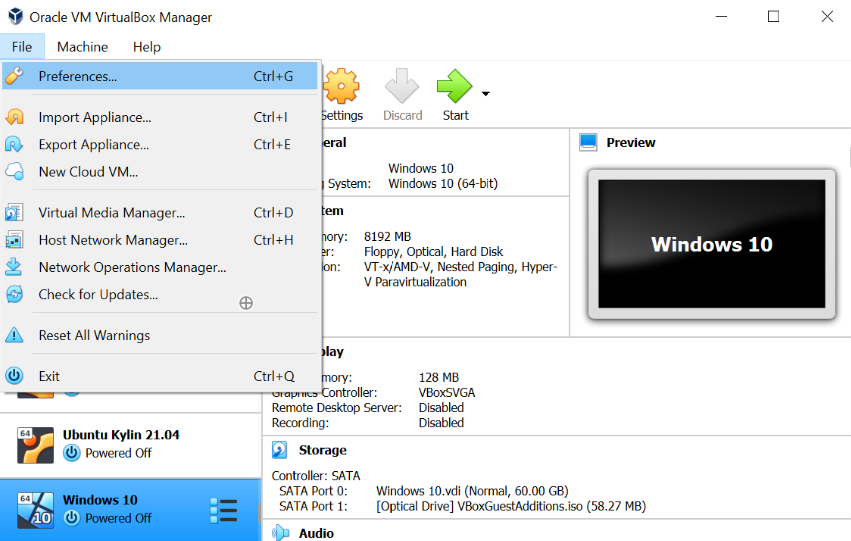
 
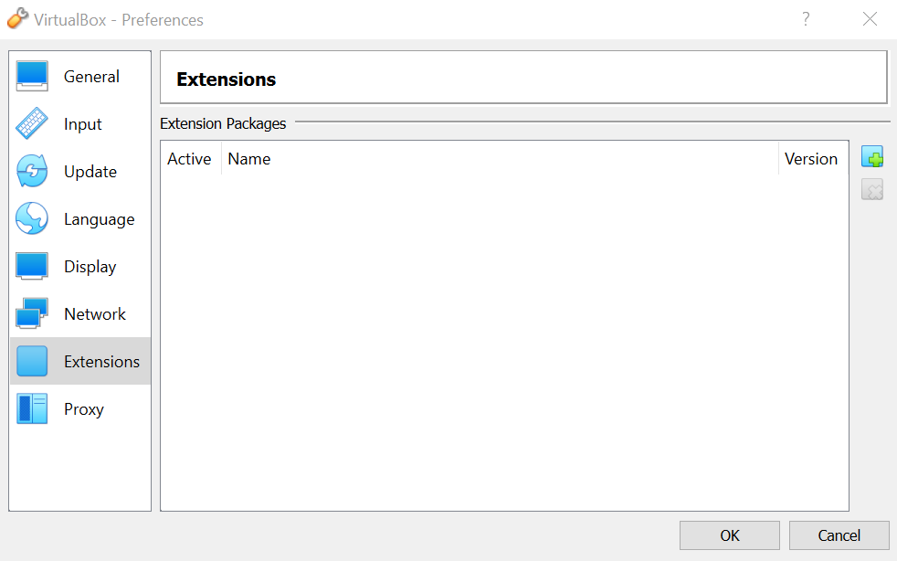
 
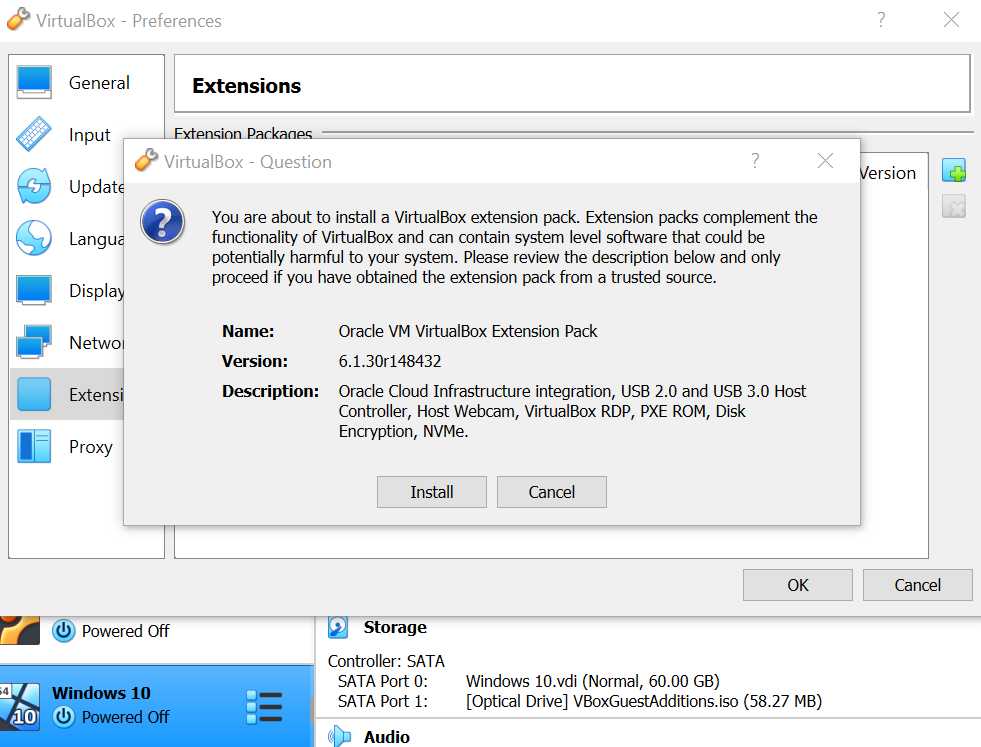
 
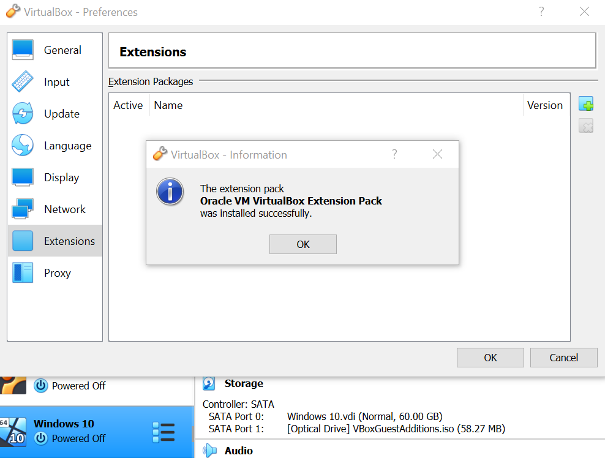
 
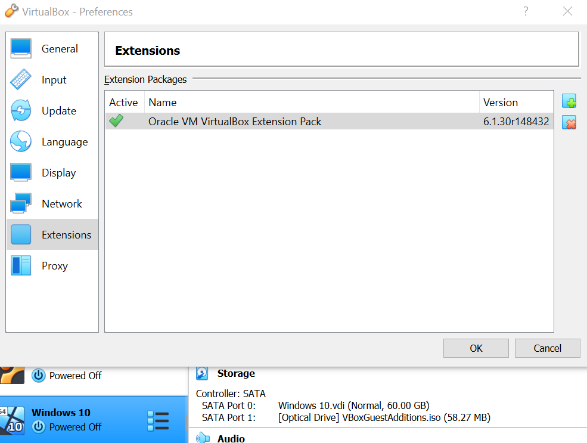
 

## - Alternatives to build a new Virtual Machine
 

> 6. Once you have installed VirtualBox, you might want to follow one of two alternatives:

> [Create a new VM from scratch](https://github.com/mora-lab/installing/edit/main/virtualbox/tutorial_v2.0b.md)

> [Import an existing VM](https://github.com/mora-lab/installing/edit/main/virtualbox/tutorial_v2.0c.md)

*Last updated: Antonio Mora, May 19th, 2022*
