# Creating a new Virtual Machine using VirtualBox
 

> The following are the instructions to create a virtual machine (VM) in **VirtualBox 6.1.34** for **Windows 10** (now referred as the "host" operative system) and install **CentOS-Stream-9** Linux system (now referred as the "guest" operative system). A similar process can be followed for other host and guest OS.

## - Downloads
 

> 1. Download the ISO file with our guest OS (CentOS-Stream-9). For this tutorial, we have downloaded our OS from here: [Download](http://mirror.stream.centos.org/9-stream/BaseOS/x86_64/iso/CentOS-Stream-9-20220509.0-x86_64-dvd1.iso).

> 2. Download VirtualBox Guest Additions: [VBox Guest Additions](https://download.virtualbox.org/virtualbox/6.1.34/VBoxGuestAdditions_6.1.34.iso).

## - Installing VirtualBox
 

> 3. If you haven't installed VirtualBox, first go to our tutorial to install it:

> [How to install VirtualBox](https://github.com/mora-lab/installing/blob/main/virtualbox/tutorial_v2.0a.md)

## - Creating a new Virtual Machine
 

> 4. Open VirtualBox. To create a new VM, click on **"New"** and choose a name, folder, and operative system to be installed.

 
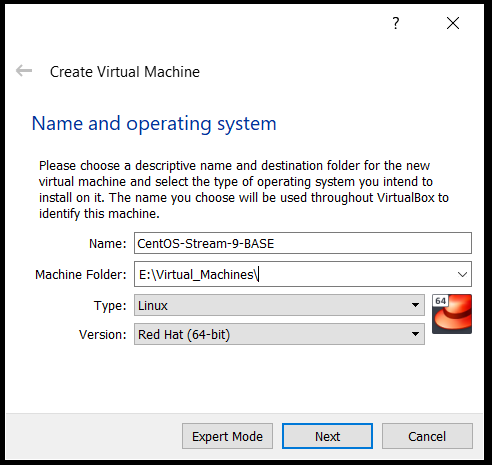
 

> 5. Define your desired memory and hard-disk specifications. Here we have chosen 8 GB memory and 40 GB hard disk.

 
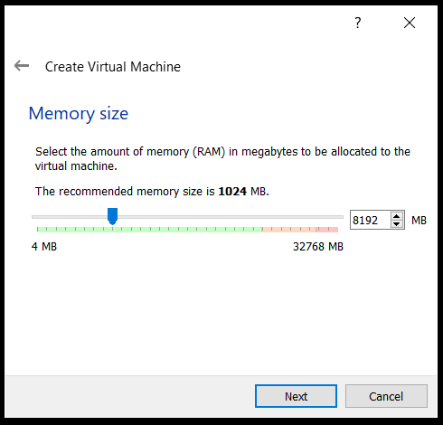
 
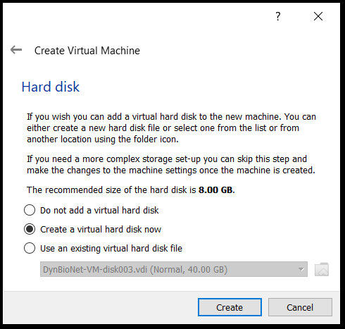
 
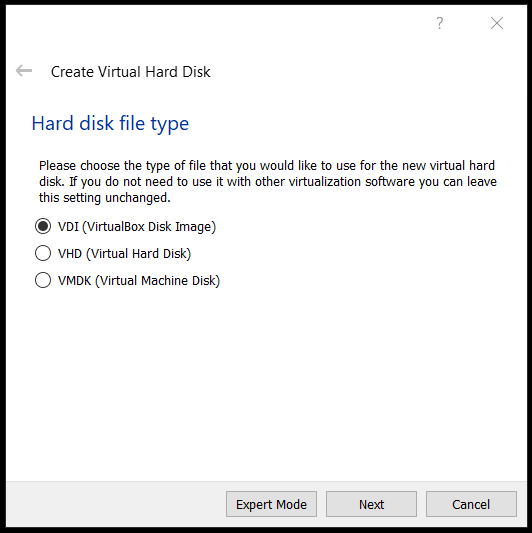
 
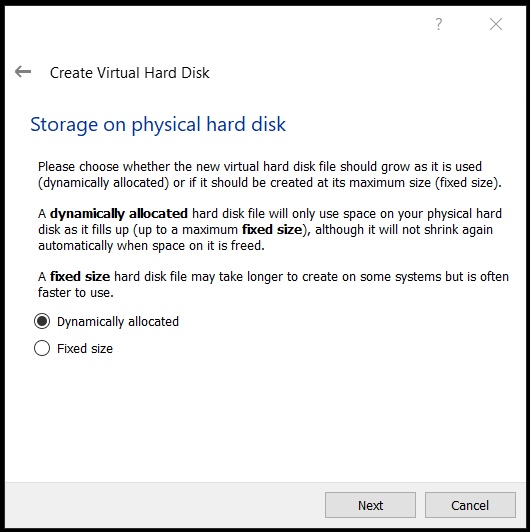
 
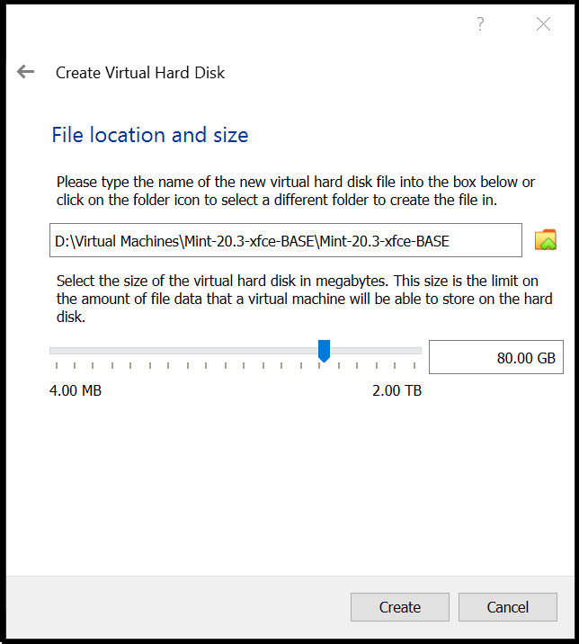
 

> 6. After this, your first Virtual Machine will be created.

 
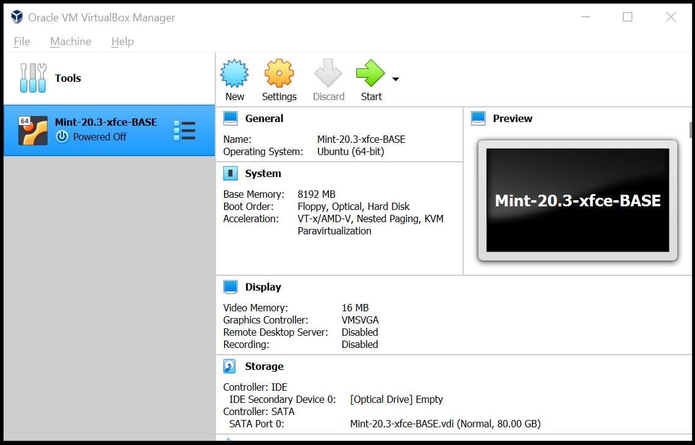
 

> 7. Optional: To improve the video memory, go to **Settings**, **Display**, and **Screen**. Here we raised the video memory from the specified value to 128 MB.

 
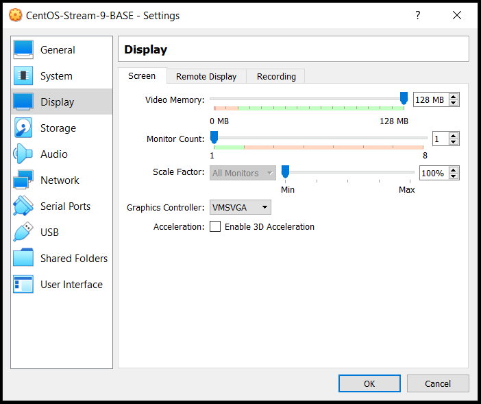
 

> 8. Optional: Go to *Settings - USB*, press the right side icon, and find the device you want to mount.

 
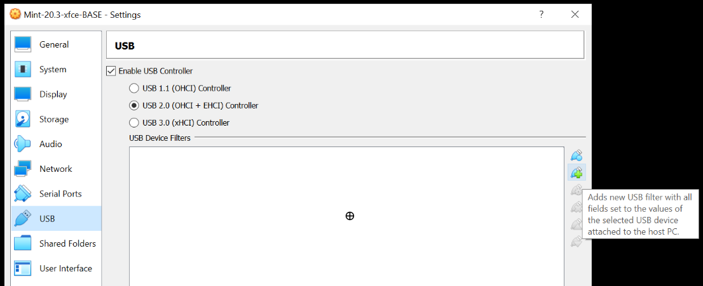
 
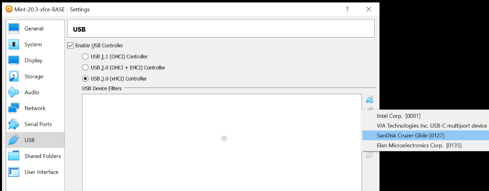
 
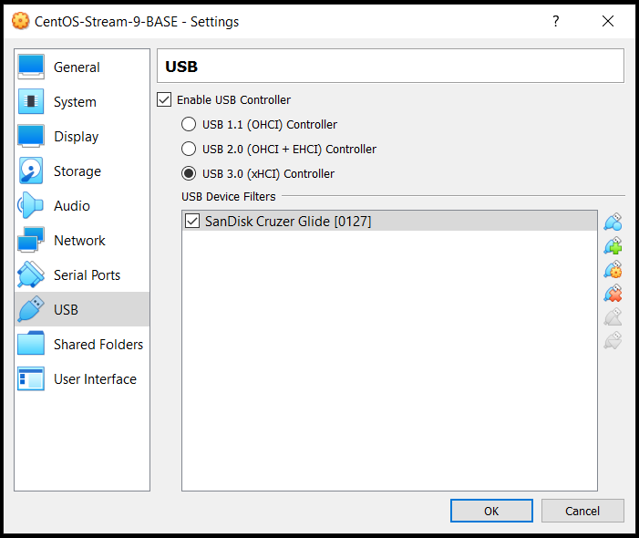
 

## - Installing the OS in our VM (CentOS-Stream-9)
 

> 9. Now we can proceed to install the OS for our new VM: First, click on the new VM and the "Select startup disk" window will be opened. Then click on the small folder icon to get the "Optical disk selector" window, click on "Add" and find the ISO file of our OS that you previously downloaded, and, finally, select the downloaded ISO file and click on "Create".

 
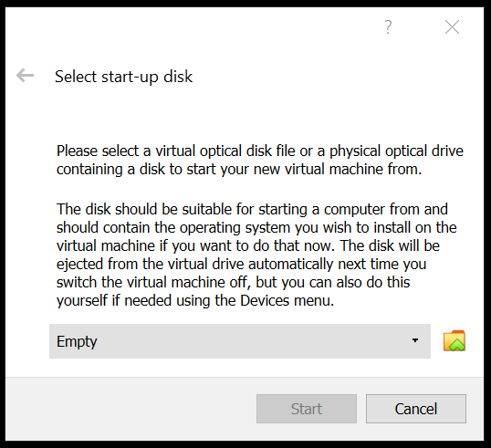
 
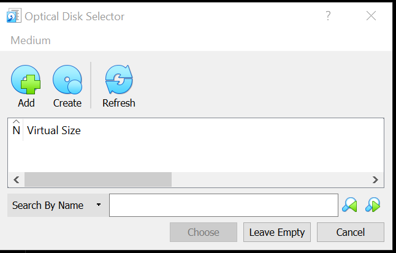
 
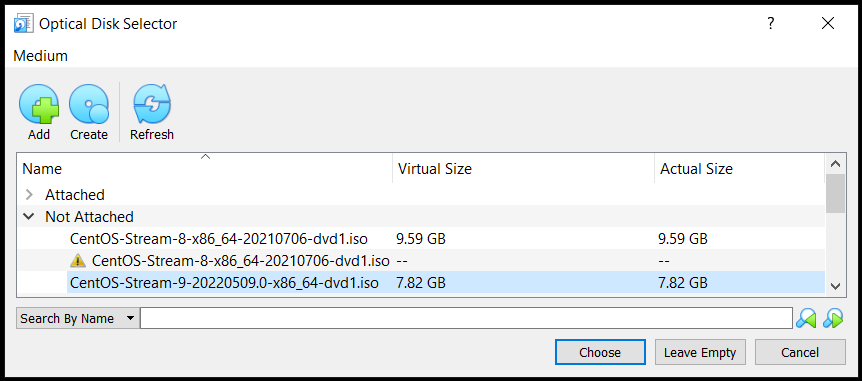
 
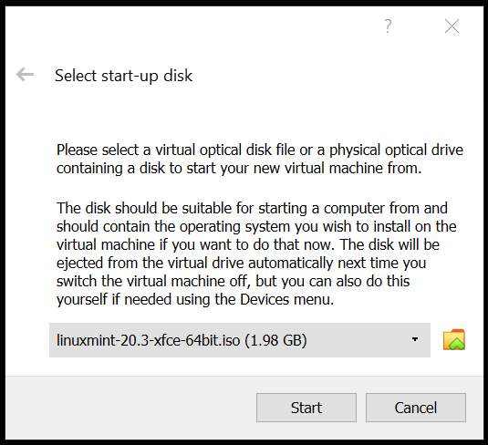
 

> 10. Press **Start** and the installation process will begin.

 
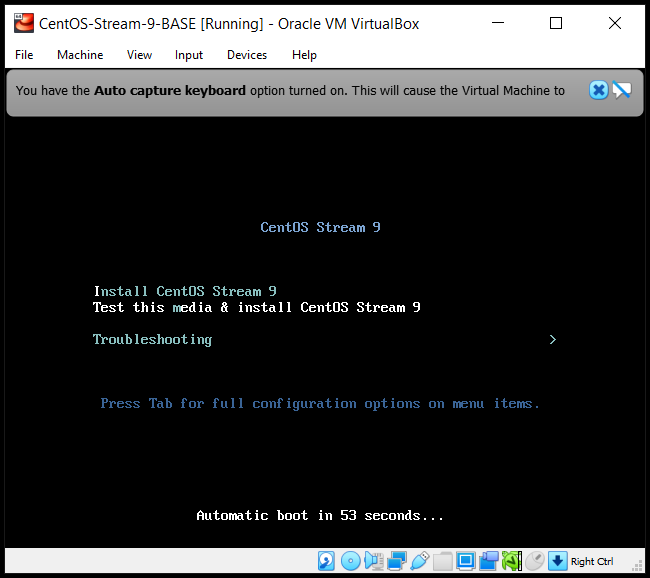
 

> 11. Choose language and installation destination (hard disk). 

 

 

 

 

> 12. Choose the base environment and additional software. We select a **"Workstation"** with GNOME, Internet, Office, and Development applications, but CentOS offers other possibilities such as servers and servers with GUI.

 

 

> 13. Choose time/date and password, and you are ready to start installing CentOS.

 

 

 

 

> 14. Press **"Begin installation"** and reboot after the process is finished.

 

 

> 15. Accept the license agreement.

 

 

 

 

> 16. Click on **Finish configuration**, and choose your privacy options.

 

 

> 17. Finally, select your username and password.

 

 

 

 

> 18. CentOS-9 is ready to be used inside the VirtualBox. However, you might find annoying that the resolution is low, the screen size stays small even if you maximize, and other details, so the next step is advised.

 

 

## - Installing VirtualBox Guest Additions
 

> 19. Inside CentOS, go to **Devices**, **Insert Guest Additions CD image**, and follow the procedure.

 

 

 

 

 

 

> 20. After restarting, you can immediately observe the changes in the screen.

## - Final result

> 21. Open the VM, and find the USB drive at *Devices - USB - NameoftheUSB*.

 
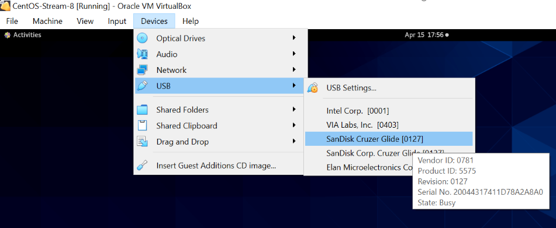
 

> 22. You can open the file manager and see the USB (in our case, appears as a "32 GB volume").

 
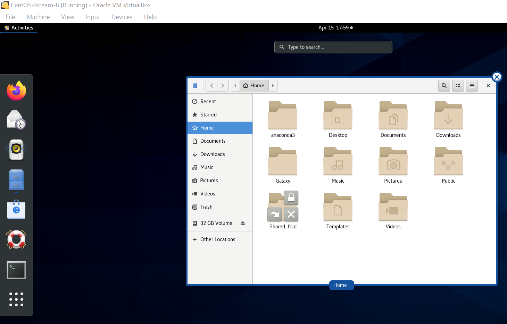
 

> 23. That's it. Now you have a fully functional **CentOS-Stream-9** VM in a **Windows 10** computer.

 

 

*Last updated: Antonio Mora, May 19th, 2022*
