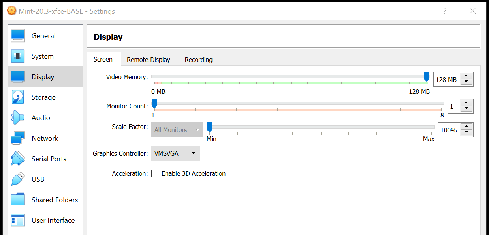
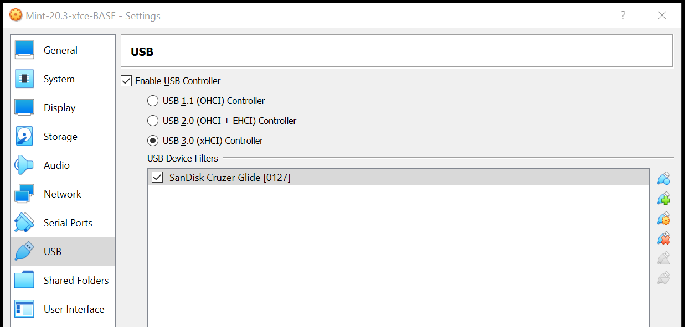
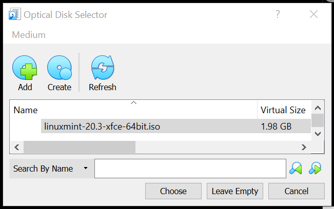
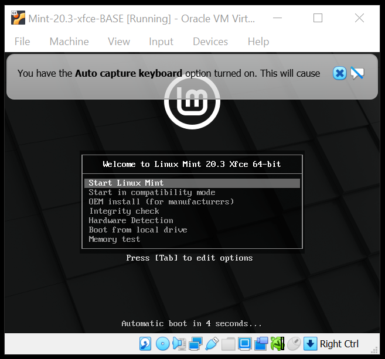
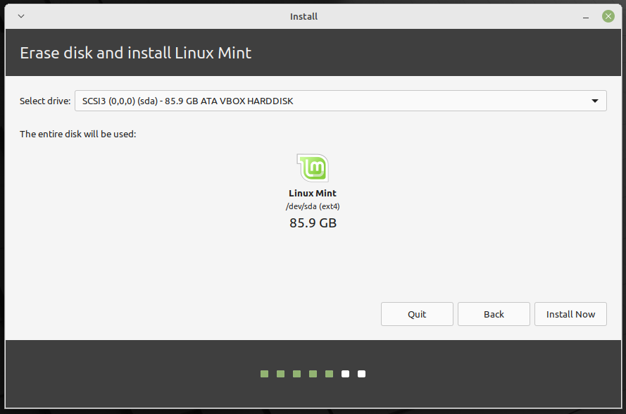

# Creating a new Virtual Machine using VirtualBox
 

> The following are the instructions to create a virtual machine (VM) in **VirtualBox 6.1.34** for **Windows 10** (now referred as the "host" operative system) and install **Mint-20.3-xfce** Linux system (now referred as the "guest" operative system). A similar process can be followed for other host and guest OS.

## - Downloads
 

> 1. Download the ISO file with our guest OS (Mint-20.3-xfce) [here](https://linuxmint.com/edition.php?id=294). For this tutorial, we have downloaded our OS from here: [Download](https://mirrors.layeronline.com/linuxmint/stable/20.3/linuxmint-20.3-xfce-64bit.iso).

## - Installing VirtualBox
 

> 2. If you haven't installed **VirtualBox**, first go to our tutorial to install it:

> [How to install VirtualBox](https://github.com/mora-lab/installing/blob/main/virtualbox/tutorial_v2.0a.md)

## - Creating a new Virtual Machine
 

> 3. Open **VirtualBox**. To create a new VM, click on **"New"** and choose a name, folder, and operative system to be installed.

 

 

> 4. Define your desired memory and hard-disk specifications. Here we have chosen 8 GB memory and 80 GB hard disk.

 

 

 

 

 

 

> 5. After this, your first Virtual Machine will be created.

 

 

> 6. Optional: To improve the video memory, go to **Settings**, **Display**, and **Screen**. Here we raised the video memory from the specified value to 128 MB.

 

 

> 7. Optional: Go to *Settings - USB*, press the right side icon, and find the device you want to mount.

 

 

 

 

## - Installing the OS in our VM (Mint-20.3-xfce)
 

> 8. Now we can proceed to install the OS for our new VM: First, click on the new VM and the "Select startup disk" window will be opened. Then click on the small folder icon to get the "Optical disk selector" window, click on "Add" and find the ISO file of our OS that you previously downloaded, and, finally, select the downloaded ISO file and click on "Create".

 

 

 

 

 

> 9. Press **Start** and the installation process will begin.

 

 

> 10. Click on "Install Linux Mint".

 

 

> 11. Select installation language and keyboard layout. 

 

 

 

> 12. Select installation type options, including multimedia codecs and erase disk options.

 

 

 

 

 

> 13. Choose location, username, and password.

 

 

 

> 14. Linux Mint will then be installed. After installation is finished, you will be prompted to press **Restart Now** and **Enter**.

 

 

 

 

> 15. Type your password and you should gain access to Linux Mint.

 

 

 

> 16. If the **Update Manager** icon displays a red spot, you may need to click to update some of the software.

 

 

 

> 17. As an alternative, we can use **apt update** and **apt upgrade**.

 

 

 

> 18. Linux Mint is ready to be used inside the VirtualBox. However, you might find annoying that the resolution is low, the screen size stays small even if you maximize, and other details, so the next step is advised.

## - Installing VirtualBox Guest Additions
 

> 19. Open a terminal and follow the procedure.

 

 

 

> 20. In the VM menu, go to **Devices** and click on **Insert Guest Additions CD image**.

 

 

 

> 21. If the CD image runs automatically, simply follow the steps. If not, open a terminal and run it as in the following example.

 

 

 

> 22. Restart the VM.

 

 

> 23. After restarting, you can immediately observe the changes in the screen.

 

 

## - Using the USB drive

> 24. To mount the USB drive, go to the menu and click on **Devices** -> **USB** -> and then the name of your USB device.

 

 

> 25. You can now open the file manager and see the USB (in our case, appears as a "32 GB volume").

 

 

## - Final result

> 26. That's it. Now you have a fully functional **Mint-20.3-xfce** VM in a **Windows 10** computer.

 

 

## - Troubleshooting

> Problem1. When you maximize your VM, only the VM menu maximizes while the Linux Mint windows stays small.
Solution1. You just need to minimize and maximize again and the changes will be evident.

> Problem2. When installing the Guest Additions, you get the error message "VERR_PDM_MEDIA_LOCKED".
Solution2. You might need to close the VM, go to **Settings**/**Storage**, click on the CD icon, and click on **Leave empty**. Then return to the VM and try to install again.

 

 

*Last updated: Antonio Mora, May 22nd, 2022*
